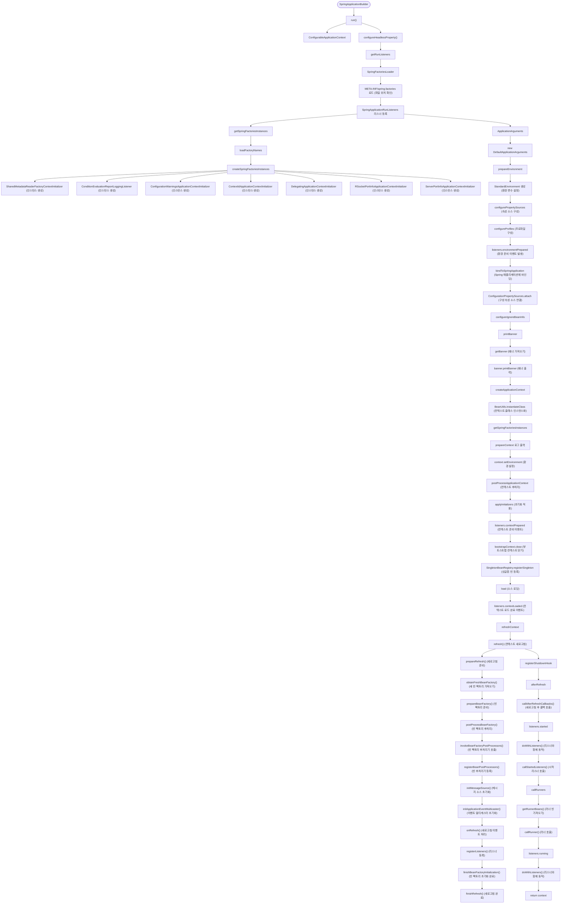

## chap00

### @SpringBootConfiguration 
@SpringBootConfiguration은 Spring Boot 애플리케이션의 설정을 나타내는 주요 어노테이션입니다. 이 어노테이션은 다음과 같은 특징을 가집니다:

1. **내부적으로 @Configuration 포함**: @SpringBootConfiguration은 내부적으로 @Configuration 어노테이션을 포함하고 있어, 해당 클래스가 빈 정의의 소스임을 나타냅니다.

2. **단일 @SpringBootConfiguration**: 일반적으로 Spring Boot 애플리케이션에는 하나의 @SpringBootConfiguration만 존재합니다. 이는 주로 메인 애플리케이션 클래스(@SpringBootApplication이 적용된 클래스)에 자동으로 포함됩니다.

3. **컴포넌트 스캔의 시작점**: 이 어노테이션이 적용된 클래스는 component scanning의 시작점이 되어, 해당 패키지와 하위 패키지에서 @Component, @Service, @Repository, @Controller 등의 어노테이션이 적용된 클래스들을 자동으로 빈으로 등록합니다.

4. **테스트에서의 활용**: @SpringBootTest 어노테이션은 @SpringBootConfiguration을 검색하여 테스트 환경을 구성합니다. 이를 통해 전체 애플리케이션 컨텍스트를 로드하지 않고도 특정 설정만 테스트할 수 있습니다.

5. **@SpringBootApplication과의 관계**: @SpringBootApplication 어노테이션은 @SpringBootConfiguration, @EnableAutoConfiguration, @ComponentScan 세 가지 어노테이션을 포함합니다.

```java
@Target(ElementType.TYPE)
@Retention(RetentionPolicy.RUNTIME)
@Documented
@Configuration
@Indexed
public @interface SpringBootConfiguration {
    @AliasFor(annotation = Configuration.class)
    boolean proxyBeanMethods() default true;
}
```

### @EnableAutoConfiguration
@EnableAutoConfiguration은 Spring Boot의 자동 구성 기능을 활성화하는 핵심 어노테이션입니다. 이 어노테이션은 다음과 같은 특징을 가집니다:

1. **자동 구성 활성화**: 클래스패스에 있는 라이브러리나 정의된 빈에 기반하여 애플리케이션 구성을 자동으로 설정합니다.

2. **META-INF/spring.factories**: Spring Boot는 이 파일에 정의된 자동 구성 클래스들을 읽어들여 조건에 맞는 구성을 활성화합니다.

3. **조건부 구성**: @ConditionalOnClass, @ConditionalOnBean, @ConditionalOnProperty 등의 조건부 어노테이션을 통해 특정 조건이 충족될 때만 구성이 적용됩니다.

4. **우선순위 관리**: @AutoConfigureOrder, @AutoConfigureBefore, @AutoConfigureAfter 어노테이션으로 자동 구성 클래스 간의 순서를 제어합니다.

5. **제외 설정**: exclude 속성을 사용하여 특정 자동 구성 클래스를 제외할 수 있습니다.

```java
@Target(ElementType.TYPE)
@Retention(RetentionPolicy.RUNTIME)
@Documented
@Inherited
@AutoConfigurationPackage
@Import(AutoConfigurationImportSelector.class)
public @interface EnableAutoConfiguration {
    String ENABLED_OVERRIDE_PROPERTY = "spring.boot.enableautoconfiguration";
    Class<?>[] exclude() default {};
    String[] excludeName() default {};
}
```


### initializers

#### SpringApplicationBuilder 
SpringApplicationBuilder는 Spring Boot 애플리케이션을 유연하게 구성할 수 있는 빌더 패턴 기반의 클래스입니다. 이 클래스는 다음과 같은 특징을 가집니다:

1. **유연한 애플리케이션 구성**: 메서드 체이닝을 통해 Spring Boot 애플리케이션의 다양한 측면을 구성할 수 있습니다.

2. **계층적 구성**: parent-child 관계를 설정하여 계층적 애플리케이션 컨텍스트를 구성할 수 있습니다.

3. **프로파일 및 속성 설정**: 특정 프로파일을 활성화하거나 애플리케이션 속성을 설정할 수 있습니다.

4. **웹 애플리케이션 타입 지정**: 웹 애플리케이션 유형(SERVLET, REACTIVE, NONE)을 명시적으로 설정할 수 있습니다.

5. **리스너 및 이니셜라이저 추가**: 애플리케이션 이벤트 리스너와 컨텍스트 이니셜라이저를 추가할 수 있습니다.

```java
public class SpringApplicationBuilder {
    private final SpringApplication application;
    private ConfigurableApplicationContext context;
    private SpringApplicationBuilder parent;
    private final AtomicBoolean running = new AtomicBoolean(false);
    private final Set<Class<?>> sources = new LinkedHashSet<>();
    private final Map<String, Object> defaultProperties = new LinkedHashMap<>();
    private ConfigurableEnvironment environment;
    private Set<String> additionalProfiles = new LinkedHashSet<>();
    private boolean registerShutdownHookApplied;
    private boolean configuredAsChild = false;
    
    // 메서드들...
    // sources(), parent(), contextClass(), properties(), profiles(), bannerMode() 등
}
```



    1. SpringApplication
    2. run()
        2.1. ConfigurableApplicationContext
        2.2. configureHeadlessProperty()
        2.3. getRunListeners(args)
            2.3.1 SpringFactoriesLoader "META-INF/spring.factories" (파일 위치 확인) 이후 SpringApplicationRunListeners 리스너 등록
                2.3.1.1 getSpringFactoriesInstances
                    2.3.1.1.1 loadFactoryNames (FACTORIES_RESOURCE_LOCATION)
                    2.3.1.1.2 createSpringFactoriesInstances (인스턴스 생성)
                    ("org.springframework.boot.autoconfigure.SharedMetadataReaderFactoryContextInitializer")
                    ("org.springframework.boot.autoconfigure.logging.ConditionEvaluationReportLoggingListener")
                    ("org.springframework.boot.context.ConfigurationWarningsApplicationContextInitializer")
                    ("org.springframework.boot.context.ContextIdApplicationContextInitializer" )
                    ("org.springframework.boot.context.config.DelegatingApplicationContextInitializer")
                    ("org.springframework.boot.rsocket.context.RSocketPortInfoApplicationContextInitializer")
                    ("org.springframework.boot.web.context.ServerPortInfoApplicationContextInitializer")
        2.4. ApplicationArguments applicationArguments = new DefaultApplicationArguments(args);
        2.5. ConfigurableEnvironment environment = prepareEnvironment(listeners, applicationArguments);
            2.5.1. StandardEnvironment 생성 (환경 변수 설정)
            2.5.2. configurePropertySources (속성 소스 구성)
            2.5.3. configureProfiles (프로파일 구성)
            2.5.4. listeners.environmentPrepared (환경 준비 이벤트 발생)
            2.5.5. bindToSpringApplication (Spring 애플리케이션에 바인딩)
            2.5.6. ConfigurationPropertySources.attach (구성 속성 소스 연결)
        2.6. configureIgnoreBeanInfo(environment);
        2.7. Banner printedBanner = printBanner(environment);
            2.7.1. getBanner() (배너 가져오기)
            2.7.2. banner.printBanner (배너 출력)
        2.8. context = createApplicationContext() DEFAULT_SERVLET_WEB_CONTEXT_CLASS, DEFAULT_REACTIVE_WEB_CONTEXT_CLASS, DEFAULT_CONTEXT_CLASS 
            (ServletWebServerApplicationContext > AnnotationConfigServletWebServerApplicationContext)
            2.8.1 BeanUtils.instantiateClass(contextClass)
        2.9. exceptionReporters = getSpringFactoriesInstances(SpringBootExceptionReporter.class, new Class[] { ConfigurableApplicationContext.class }, context);
        2.10. prepareContext 로그 출력 StartupInfoLogger (Starting PrimaveraApplication on Genius-MacBook-Pro.local with PID...)
            2.10.1 context.setEnvironment(environment)
            2.10.2 postProcessApplicationContext(context)
            2.10.3 applyInitializers(context) : initializers 등록된 initializer initialize 함
            2.10.4 listeners.contextPrepared(context)
            2.10.5 bootstrapContext.close() (부트스트랩 컨텍스트 닫기)
            2.10.6 SingletonBeanRegistry.registerSingleton (싱글톤 빈 등록)
            2.10.7 load(context, sources) (소스 로딩)
            2.10.8 listeners.contextLoaded (컨텍스트 로드 완료 이벤트)
        2.11. refreshContext
            2.11.1 refresh() (컨텍스트 새로고침)
                2.11.1.1 prepareRefresh() (새로고침 준비)
                2.11.1.2 obtainFreshBeanFactory() (새 빈 팩토리 가져오기)
                2.11.1.3 prepareBeanFactory() (빈 팩토리 준비)
                2.11.1.4 postProcessBeanFactory() (빈 팩토리 후처리)
                2.11.1.5 invokeBeanFactoryPostProcessors() (빈 팩토리 후처리기 호출)
                2.11.1.6 registerBeanPostProcessors() (빈 후처리기 등록)
                2.11.1.7 initMessageSource() (메시지 소스 초기화)
                2.11.1.8 initApplicationEventMulticaster() (이벤트 멀티캐스터 초기화)
                2.11.1.9 onRefresh() (새로고침 이벤트 처리)
                2.11.1.10 registerListeners() (리스너 등록)
                2.11.1.11 finishBeanFactoryInitialization() (빈 팩토리 초기화 완료)
                2.11.1.12 finishRefresh() (새로고침 완료)
            2.11.2 this.registerShutdownHook ? context.registerShutdownHook()
        2.12. afterRefresh
            2.12.1 callAfterRefreshCallbacks() (새로고침 후 콜백 호출)
        2.13. listeners.started
            2.13.1 doWithListeners() (리스너와 함께 동작)
            2.13.2 callStartedListeners() (시작 리스너 호출)
        2.14. callRunners
            2.14.1 getRunnerBeans() (러너 빈 가져오기)
            2.14.2 callRunner() (러너 호출)
        2.15. listeners.running
            2.15.1 doWithListeners() (리스너와 함께 동작)
        2.16. return context
````
