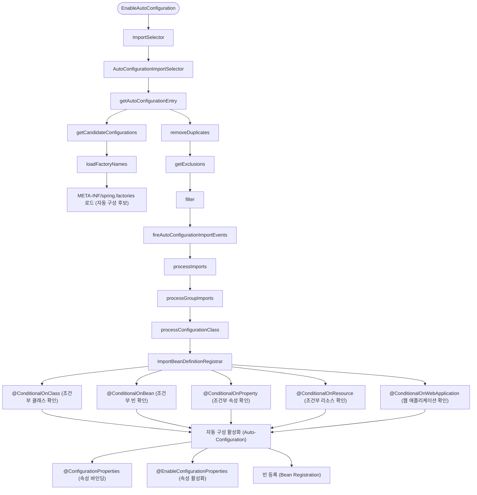

## chap00

### @SpringBootConfiguration 
@SpringBootConfiguration은 Spring Boot 애플리케이션의 설정을 나타내는 주요 어노테이션입니다. 이 어노테이션은 다음과 같은 특징을 가집니다:

1. **내부적으로 @Configuration 포함**: @SpringBootConfiguration은 내부적으로 @Configuration 어노테이션을 포함하고 있어, 해당 클래스가 빈 정의의 소스임을 나타냅니다.

2. **단일 @SpringBootConfiguration**: 일반적으로 Spring Boot 애플리케이션에는 하나의 @SpringBootConfiguration만 존재합니다. 이는 주로 메인 애플리케이션 클래스(@SpringBootApplication이 적용된 클래스)에 자동으로 포함됩니다.

3. **컴포넌트 스캔의 시작점**: 이 어노테이션이 적용된 클래스는 component scanning의 시작점이 되어, 해당 패키지와 하위 패키지에서 @Component, @Service, @Repository, @Controller 등의 어노테이션이 적용된 클래스들을 자동으로 빈으로 등록합니다.

4. **테스트에서의 활용**: @SpringBootTest 어노테이션은 @SpringBootConfiguration을 검색하여 테스트 환경을 구성합니다. 이를 통해 전체 애플리케이션 컨텍스트를 로드하지 않고도 특정 설정만 테스트할 수 있습니다.

5. **@SpringBootApplication과의 관계**: @SpringBootApplication 어노테이션은 @SpringBootConfiguration, @EnableAutoConfiguration, @ComponentScan 세 가지 어노테이션을 포함합니다.

```java
@Target(ElementType.TYPE)
@Retention(RetentionPolicy.RUNTIME)
@Documented
@Configuration
@Indexed
public @interface SpringBootConfiguration {
    @AliasFor(annotation = Configuration.class)
    boolean proxyBeanMethods() default true;
}
```

### @EnableAutoConfiguration


### initializers

#### SpringApplicationBuilder 

```mermaid
flowchart TB
    start([SpringApplication]) --> run[run()]
    run --> context[ConfigurableApplicationContext]
    run --> headless[configureHeadlessProperty()]
    
    headless --> listeners[getRunListeners]
    listeners --> factories[SpringFactoriesLoader]
    factories --> factoriesLoader["META-INF/spring.factories 로드 (파일 위치 확인)"]
    factoriesLoader --> registerListeners[SpringApplicationRunListeners 리스너 등록]
    registerListeners --> getInstances[getSpringFactoriesInstances]
    getInstances --> loadNames[loadFactoryNames]
    loadNames --> createInstances[createSpringFactoriesInstances]
    createInstances --> initFactory1["SharedMetadataReaderFactoryContextInitializer (인스턴스 생성)"]
    createInstances --> initFactory2["ConditionEvaluationReportLoggingListener (인스턴스 생성)"]
    createInstances --> initFactory3["ConfigurationWarningsApplicationContextInitializer (인스턴스 생성)"]
    createInstances --> initFactory4["ContextIdApplicationContextInitializer (인스턴스 생성)"]
    createInstances --> initFactory5["DelegatingApplicationContextInitializer (인스턴스 생성)"]
    createInstances --> initFactory6["RSocketPortInfoApplicationContextInitializer (인스턴스 생성)"]
    createInstances --> initFactory7["ServerPortInfoApplicationContextInitializer (인스턴스 생성)"]
    
    registerListeners --> args[ApplicationArguments]
    args --> createArgs[new DefaultApplicationArguments]
    
    createArgs --> env[prepareEnvironment]
    env --> stdEnv[StandardEnvironment 생성]
    stdEnv --> propSources[configurePropertySources]
    propSources --> profiles[configureProfiles]
    profiles --> envPrepared[listeners.environmentPrepared]
    envPrepared --> bind[bindToSpringApplication]
    bind --> attachProps[ConfigurationPropertySources.attach]
    
    attachProps --> ignoreBeanInfo[configureIgnoreBeanInfo]
    ignoreBeanInfo --> banner[printBanner]
    banner --> getBanner[getBanner]
    getBanner --> printBanner[banner.printBanner]
    
    printBanner --> createAppContext[createApplicationContext]
    createAppContext --> instantiate[BeanUtils.instantiateClass]
    
    instantiate --> reporters[getSpringFactoriesInstances]
    reporters --> prepareContext[prepareContext]
    prepareContext --> setEnv[context.setEnvironment]
    setEnv --> postProcess[postProcessApplicationContext]
    postProcess --> applyInit[applyInitializers]
    applyInit --> contextPrepared[listeners.contextPrepared]
    contextPrepared --> closeBootstrap[bootstrapContext.close]
    closeBootstrap --> registerSingleton[SingletonBeanRegistry.registerSingleton]
    registerSingleton --> loadSources[load]
    loadSources --> contextLoaded[listeners.contextLoaded]
    
    contextLoaded --> refreshContext[refreshContext]
    refreshContext --> refresh[refresh]
    refresh --> prepareRefresh[prepareRefresh]
    prepareRefresh --> obtainFactory[obtainFreshBeanFactory]
    obtainFactory --> prepareFactory[prepareBeanFactory]
    prepareFactory --> postProcessFactory[postProcessBeanFactory]
    postProcessFactory --> invokeFactoryPostProcessors[invokeBeanFactoryPostProcessors]
    invokeFactoryPostProcessors --> registerPostProcessors[registerBeanPostProcessors]
    registerPostProcessors --> initMsg[initMessageSource]
    initMsg --> initEventCaster[initApplicationEventMulticaster]
    initEventCaster --> onRefresh[onRefresh]
    onRefresh --> registerL[registerListeners]
    registerL --> finishBeanFactory[finishBeanFactoryInitialization]
    finishBeanFactory --> finishRefresh[finishRefresh]
    
    refresh --> registerShutdown[registerShutdownHook]
    
    registerShutdown --> afterRefresh[afterRefresh]
    afterRefresh --> callRefreshCallbacks[callAfterRefreshCallbacks]
    
    callRefreshCallbacks --> listenersStarted[listeners.started]
    listenersStarted --> doWithListeners[doWithListeners]
    doWithListeners --> callStartedListeners[callStartedListeners]
    
    callStartedListeners --> callRunners[callRunners]
    callRunners --> getRunnerBeans[getRunnerBeans]
    getRunnerBeans --> callRunner[callRunner]
    
    callRunner --> listenersRunning[listeners.running]
    listenersRunning --> doWithListeners2[doWithListeners]
    
    doWithListeners2 --> returnContext[return context]
```

### Reference
1. [ServletWebServerApplicationContext](https://docs.spring.io/spring-boot/docs/current/api/org/springframework/boot/web/servlet/context/ServletWebServerApplicationContext.html)