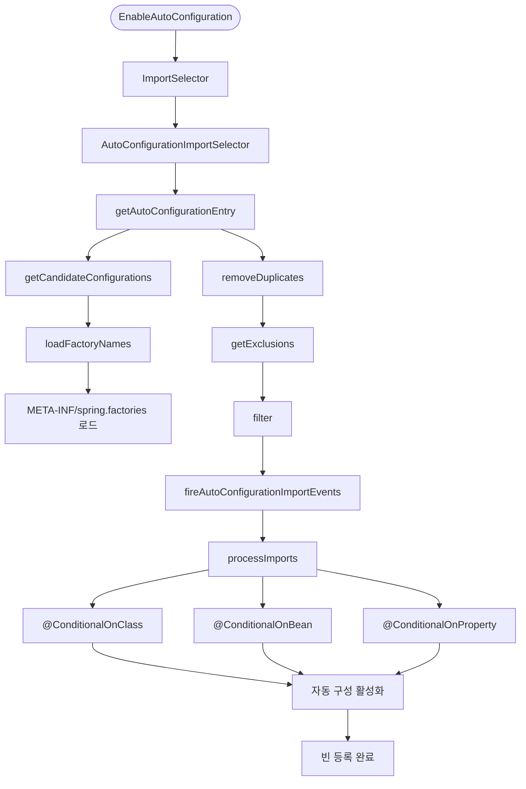
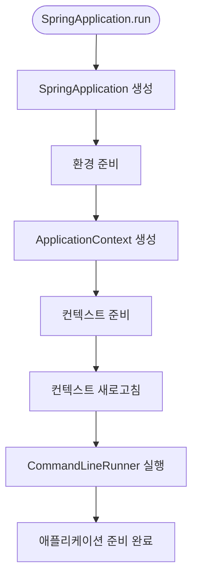

# Chapter 01 - Spring Boot 시작하기 🌱

## 📋 개요
Spring Boot의 핵심 개념과 애플리케이션 구동 원리를 이해하는 기초 챕터입니다. `@SpringBootApplication` 어노테이션의 내부 동작과 자동 구성(Auto Configuration) 메커니즘을 심도 있게 학습합니다.

## 🎯 학습 목표
- **Spring Boot 핵심 어노테이션** 이해 및 활용
- **자동 구성(Auto Configuration)** 동작 원리 파악
- **SpringApplicationBuilder** 패턴 마스터
- **Domain-Driven Design** 기초 개념 적용
- **Bean 생명주기와 Scope** 이해
- **의존성 주입(DI) 패턴** 마스터
- **설정 관리** 기초 학습
- **기본 웹 개념** 이해

## 🛠️ 핵심 기술 스택
- **Java 21** - Record, Switch Expression 활용
- **Spring Boot 3.3.6** - 최신 부트 프레임워크
- **Spring Context** - IoC 컨테이너 관리
- **Gradle 8.12.1** - 빌드 자동화
- **Jakarta Annotations** - 표준 어노테이션 지원

## 📚 주요 학습 내용

### 1. @SpringBootConfiguration 심화 분석

`@SpringBootConfiguration`은 Spring Boot 애플리케이션의 설정을 나타내는 핵심 어노테이션입니다.

**주요 특징:**
- **내부적으로 @Configuration 포함**: 빈 정의의 소스임을 명시
- **단일 @SpringBootConfiguration**: 애플리케이션당 하나만 존재
- **컴포넌트 스캔의 시작점**: 패키지 기반 자동 빈 등록
- **테스트 환경 구성**: @SpringBootTest와 연동
- **@SpringBootApplication과의 관계**: 3가지 어노테이션 통합

```java
@Target(ElementType.TYPE)
@Retention(RetentionPolicy.RUNTIME)
@Documented
@Configuration
@Indexed
public @interface SpringBootConfiguration {
    @AliasFor(annotation = Configuration.class)
    boolean proxyBeanMethods() default true;
}
```

### 2. @EnableAutoConfiguration 메커니즘

Spring Boot의 자동 구성 기능을 활성화하는 핵심 어노테이션입니다.

**핵심 동작 원리:**
- **META-INF/spring.factories** 파일 기반 구성 클래스 로드
- **조건부 구성**: @ConditionalOnClass, @ConditionalOnBean 등
- **우선순위 관리**: @AutoConfigureOrder, @AutoConfigureBefore
- **제외 설정**: exclude 속성으로 특정 구성 제외

```java
@Target(ElementType.TYPE)
@Retention(RetentionPolicy.RUNTIME)
@Documented
@Inherited
@AutoConfigurationPackage
@Import(AutoConfigurationImportSelector.class)
public @interface EnableAutoConfiguration {
    String ENABLED_OVERRIDE_PROPERTY = "spring.boot.enableautoconfiguration";
    Class<?>[] exclude() default {};
    String[] excludeName() default {};
}
```

### 3. Auto Configuration 동작 플로우



### 4. SpringApplicationBuilder 패턴

유연한 애플리케이션 구성을 위한 빌더 패턴 기반 클래스입니다.

**주요 기능:**
- **유연한 애플리케이션 구성**: 메서드 체이닝 지원
- **계층적 구성**: parent-child 관계 설정
- **프로파일 및 속성 설정**: 환경별 구성 관리
- **웹 애플리케이션 타입 지정**: SERVLET, REACTIVE, NONE
- **리스너 및 이니셜라이저 추가**: 이벤트 기반 확장

```java
public class PrimaveraApplication {
    private static final String APPLICATION = 
        "spring.config.location=classpath:/application-${spring.profiles.active:default}.yml";

    public static void main(String[] args) {
        new SpringApplicationBuilder(PrimaveraApplication.class)
                .bannerMode(Banner.Mode.OFF)
                .properties(APPLICATION)
                .build()
                .run(args);
    }
}
```

### 5. Spring Boot 애플리케이션 시작 프로세스



**상세 단계:**
1. **환경 준비**: 프로파일, 속성 설정
2. **컨텍스트 생성**: ServletWebServerApplicationContext
3. **자동 구성 적용**: EnableAutoConfiguration 동작
4. **빈 등록 및 초기화**: IoC 컨테이너 구성
5. **웹 서버 시작**: 내장 Tomcat/Undertow 구동

### 6. Bean 생명주기와 Scope 이해

Spring Bean의 생명주기와 다양한 Scope를 학습합니다.

**Bean 생명주기 단계:**
1. **인스턴스 생성** - Constructor 호출
2. **의존성 주입** - Properties 설정
3. **초기화 콜백** - @PostConstruct, InitializingBean
4. **사용 준비 완료** - Bean 사용 가능
5. **소멸 전 콜백** - @PreDestroy, DisposableBean
6. **Bean 소멸** - 컨테이너 종료 시

**예제: BeanLifecycleExample.java**
- Constructor → afterPropertiesSet() → @PostConstruct 순서로 실행
- @PreDestroy → destroy() 순서로 종료
- 각 단계별 상태 추적 가능

**Bean Scope 종류:**
- **singleton** (기본값): 애플리케이션당 하나의 인스턴스
- **prototype**: 요청할 때마다 새로운 인스턴스 생성
- **request**: HTTP 요청당 하나 (웹 애플리케이션)
- **session**: HTTP 세션당 하나 (웹 애플리케이션)

**예제: BeanScopeExample.java**
- SingletonBean: 항상 같은 인스턴스 반환
- PrototypeBean: 매번 새로운 인스턴스 생성

### 7. 의존성 주입(DI) 패턴 완벽 가이드

다양한 의존성 주입 방법과 각각의 장단점을 학습합니다.

**예제: DependencyInjectionExample.java**

**1. Constructor Injection (권장) ✅**
```java
@Component
@RequiredArgsConstructor
public static class ConstructorInjection {
    private final MessageService messageService;
}
```
- 불변성 보장 (final 키워드 사용 가능)
- 순환 참조 컴파일 시점 감지
- 테스트 용이성

**2. Setter Injection**
```java
@Autowired
public void setMessageService(MessageService messageService) {
    this.messageService = messageService;
}
```
- 선택적 의존성에 유용
- 런타임에 변경 가능

**3. Field Injection**
```java
@Autowired
private MessageService messageService;
```
- 코드 간결성
- 테스트 어려움 (리플렉션 필요)
- 불변성 보장 불가

**4. @Qualifier와 @Primary 사용**
- **@Primary**: 여러 구현체 중 기본값 지정
- **@Qualifier**: 특정 Bean을 명시적으로 선택

### 8. 설정 관리 기초

애플리케이션 설정을 관리하는 다양한 방법을 학습합니다.

**예제: ConfigurationExample.java**

**1. @Value 어노테이션**
- 단순한 값 주입
- 기본값 설정 가능
- SpEL(Spring Expression Language) 지원

```java
@Value("${app.name:Primavera}")
private String appName;

@Value("#{'${app.features:feature1,feature2}'.split(',')}")
private List<String> features;
```

**2. @ConfigurationProperties**
- 타입 안전한 설정 바인딩
- 계층적 구조 지원
- IDE 자동완성 지원
- 유효성 검증 가능

```java
@ConfigurationProperties(prefix = "app")
public class AppProperties {
    private String name;
    private Database database;
    // getter/setter
}
```

**3. application.yml 설정 예제**
```yaml
app:
  name: Primavera Tutorial
  version: 1.0.0
  database:
    url: jdbc:h2:mem:primavera
    max-connections: 20
```

### 9. 기본 웹 개념

Spring Boot의 웹 개발 기초 개념을 학습합니다.

**예제: WebBasicsController.java**

**1. HTTP 메서드 매핑**
- @GetMapping, @PostMapping, @PutMapping, @DeleteMapping
- @RequestMapping의 세부 설정

**2. 파라미터 바인딩**
- **@PathVariable**: URL 경로의 변수 추출
- **@RequestParam**: 쿼리 파라미터 추출
- **@RequestBody**: HTTP 본문을 객체로 변환
- **@RequestHeader**: HTTP 헤더 값 추출

**3. 응답 처리**
- **ResponseEntity**: 상태 코드와 헤더 제어
- **@ResponseStatus**: 응답 상태 지정
- **@RestController**: @Controller + @ResponseBody

**4. 예외 처리**
- **@ExceptionHandler**: 컨트롤러 레벨 예외 처리
- **@ControllerAdvice**: 전역 예외 처리
- **커스텀 예외 응답**: ErrorResponse 객체

```java
@ExceptionHandler(ResourceNotFoundException.class)
public ResponseEntity<ErrorResponse> handleNotFound(ResourceNotFoundException e) {
    return ResponseEntity.notFound().build();
}
```

## 🔧 실습 예제

### Bean 등록 방식 학습 예제

Spring에서 Bean을 등록하는 다양한 방법을 학습할 수 있는 예제입니다.

**1. 어노테이션 기반 등록 (@RestController)**
```java
@RestController
@RequiredArgsConstructor
public class HelloController {
    private final GreetingService greetingService;
    private final WorldService worldService;
    
    @GetMapping("/greeting")
    public String greeting() {
        return greetingService.hello() + " " + worldService.world();
    }
}
```

**2. 프로그래매틱 등록 (ApplicationContextInitializer)**
```java
SpringApplication springApplication = new SpringApplicationBuilder(SpringBootStarterApplication.class)
    .initializers((applicationContext) -> {
        if (applicationContext instanceof GenericApplicationContext genericContext) {
            // 서비스 Bean 등록
            genericContext.registerBean(WorldService.class, WorldServiceImpl.class);
            genericContext.registerBean(GreetingService.class, GreetingServiceImpl.class);
            
            // 컨트롤러 Bean 등록 (의존성 주입 포함)
            genericContext.registerBean(HelloController.class, () -> {
                WorldService worldService = genericContext.getBean(WorldService.class);
                GreetingService greetingService = genericContext.getBean(GreetingService.class);
                return new HelloController(greetingService, worldService);
            });
        }
    })
    .build();
```

**⚠️ 주의사항: Bean 중복 등록**
- 위 두 방식을 동시에 사용하면 Bean 중복 등록으로 인한 충돌이 발생할 수 있습니다.
- 충돌 발생 시 해결 방법:
  1. `SpringBootStarterApplication`의 HelloController 등록 부분 주석 처리
  2. `HelloController`의 `@RestController` 어노테이션 제거
- 실제 개발에서는 일관된 방식 하나만 선택하여 사용하세요.

### Spring Boot 이벤트 처리 학습

애플리케이션 생명주기의 다양한 이벤트를 처리하는 방법을 학습할 수 있습니다.

```java
@SpringBootApplication
public class SpringBootStarterApplication {
    
    // 1. 애플리케이션 시작 이벤트
    @EventListener({ApplicationStartingEvent.class})
    public void applicationStartingEvent(ApplicationStartingEvent event) {
        log.info("[SpringBoot] ApplicationStartingEvent: {}", event);
    }
    
    // 2. 웹 서버 초기화 이벤트
    @EventListener({ServletWebServerInitializedEvent.class})
    public void servletWebServerInitializedEvent(ServletWebServerInitializedEvent event) {
        log.info("[SpringBoot] ServletWebServerInitializedEvent: {}", event);
    }
    
    // 3. 애플리케이션 컨텍스트 초기화 이벤트
    @EventListener({ApplicationContextInitializedEvent.class})
    public void applicationContextInitializedEvent(ApplicationContextInitializedEvent event) {
        log.info("[SpringBoot] ApplicationContextInitializedEvent: {}", event);
    }
    
    // 4. Bean 초기화 후 처리
    @PostConstruct
    private void postConstruct() {
        log.info("[SpringBoot] @PostConstruct 호출");
    }
    
    // 5. 애플리케이션 시작 완료 이벤트
    @EventListener({ApplicationStartedEvent.class})
    public void applicationStartedEvent(ApplicationStartedEvent event) {
        log.info("[SpringBoot] ApplicationStartedEvent: {}", event);
    }
    
    // 6. 애플리케이션 준비 완료 이벤트
    @EventListener({ApplicationReadyEvent.class})
    public void applicationReadyEvent(ApplicationReadyEvent event) {
        log.info("[SpringBoot] ApplicationReadyEvent: {}", event);
    }
    
    // 7. 애플리케이션 시작 후 실행되는 Runner들
    @Bean
    protected ApplicationRunner applicationRunner() {
        return (args) -> log.info("[SpringBoot] ApplicationRunner Args: {}", (Object) args);
    }
    
    @Bean
    protected CommandLineRunner commandLineRunner() {
        return (args) -> log.info("[SpringBoot] CommandLineRunner Args: {}", (Object) args);
    }
}
```

**이벤트 실행 순서:**
1. ApplicationStartingEvent → 애플리케이션 시작
2. ApplicationContextInitializedEvent → 컨텍스트 초기화
3. ServletWebServerInitializedEvent → 웹 서버 초기화
4. @PostConstruct → Bean 후처리
5. ApplicationStartedEvent → 시작 완료
6. ApplicationReadyEvent → 준비 완료
7. ApplicationRunner/CommandLineRunner → 사용자 정의 실행

### 핵심 애플리케이션 클래스

```java
@SpringBootApplication
public class PrimaveraApplication {
    
    // SpringApplicationBuilder를 통한 유연한 구성
    private static final String APPLICATION_CONFIG = 
        "spring.config.location=classpath:/application-${spring.profiles.active:default}.yml";
    
    public static void main(String[] args) {
        new SpringApplicationBuilder(PrimaveraApplication.class)
                .bannerMode(Banner.Mode.OFF)
                .properties(APPLICATION_CONFIG)
                .web(WebApplicationType.SERVLET)
                .run(args);
    }
    
    // 커스텀 초기화 빈
    @Bean
    public ApplicationRunner applicationRunner() {
        return args -> {
            log.info("🌸 Primavera Application이 성공적으로 시작되었습니다!");
            log.info("📊 활성 프로파일: {}", 
                Arrays.toString(environment.getActiveProfiles()));
        };
    }
}
```

### 자동 구성 테스트

```java
@SpringBootTest
class AutoConfigurationTest {
    
    @Autowired
    private ApplicationContext context;
    
    @Test
    @DisplayName("Spring Boot 자동 구성이 정상적으로 동작하는지 확인")
    void testAutoConfiguration() {
        // DataSource 자동 구성 확인
        assertThat(context.getBean(DataSource.class)).isNotNull();
        
        // WebMvcConfigurer 자동 구성 확인
        assertThat(context.getBean(WebMvcConfigurer.class)).isNotNull();
        
        // 사용자 정의 빈 등록 확인
        assertThat(context.getBean(PrimaveraApplication.class)).isNotNull();
    }
}
```

## 🧪 테스트 전략

### 단위 테스트
- **@SpringBootTest**: 전체 애플리케이션 컨텍스트 로드
- **@TestConfiguration**: 테스트 전용 구성
- **@MockBean**: 특정 빈 모킹

### 통합 테스트
- **ApplicationContext 검증**: 빈 등록 상태 확인
- **자동 구성 검증**: 조건부 빈 생성 테스트
- **프로파일별 테스트**: 환경별 구성 검증

## 🐳 인프라 설정

### Docker Compose 환경 설정

이 챕터는 **기초 학습용 인프라**를 사용합니다:

```bash
# infrastructure 디렉터리로 이동
cd infrastructure

# 기초 학습용 Docker Compose 실행 (MariaDB)
docker-compose -f docker-compose.basic.yml up -d

# 서비스 상태 확인
docker-compose -f docker-compose.basic.yml ps

# 정리 (컨테이너 및 볼륨 삭제)
docker-compose -f docker-compose.basic.yml down -v
```

**포함된 서비스:**
- **MariaDB 11.4.7** (포트: 3308)
- 기본 데이터베이스 스키마 자동 생성

**애플리케이션 실행:**
```bash
# 인프라 시작 후 애플리케이션 실행
./gradlew :chap01:bootRun -Dspring.profiles.active=local
```

## 📖 참고 자료

### 공식 문서
- [Spring Boot Reference Guide](https://docs.spring.io/spring-boot/docs/current/reference/html/)
- [Spring Framework Core](https://docs.spring.io/spring-framework/docs/current/reference/html/core.html)
- [Auto-configuration Classes](https://docs.spring.io/spring-boot/docs/current/reference/html/auto-configuration-classes.html)

### 추가 학습 자료
- [Spring Boot Starters](https://docs.spring.io/spring-boot/docs/current/reference/html/using.html#using.build-systems.starters)
- [Creating Your Own Auto-configuration](https://docs.spring.io/spring-boot/docs/current/reference/html/features.html#features.developing-auto-configuration)
- [SpringApplication](https://docs.spring.io/spring-boot/docs/current/api/org/springframework/boot/SpringApplication.html)

## 🚀 다음 단계

다음 Chapter에서는 **설정과 의존성 주입**을 학습합니다:
- `@ConfigurationProperties`를 통한 타입 안전한 설정
- Bean Scope와 라이프사이클 관리
- 프로파일별 환경 설정 전략

---

**🎓 학습 포인트**: Spring Boot의 자동 구성 메커니즘을 이해하면 프레임워크의 "마법" 같은 동작을 명확히 파악할 수 있습니다. 이는 문제 해결과 커스터마이징에 필수적인 지식입니다.