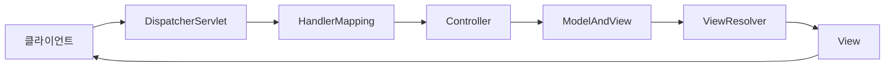

# Chapter 03 - MVC와 AOP 🎯

## 📋 개요
Spring MVC 아키텍처 패턴과 AOP(Aspect-Oriented Programming)를 통한 횡단 관심사 분리를 학습하는 챕터입니다. 웹 계층의 구성 요소와 관점 지향 프로그래밍의 핵심 개념을 실무 중심으로 익힙니다.

## 🎯 학습 목표
- **Spring MVC 아키텍처** 패턴 완전 이해
- **AOP를 통한 횡단 관심사** 분리 구현
- **인터셉터와 필터 체인** 설계 및 활용
- **@Aspect, @Around** 어노테이션 마스터
- **ResponseBodyAdvice** 를 통한 응답 처리

## 🛠️ 핵심 기술 스택
- **Spring Web MVC** - 웹 애플리케이션 아키텍처
- **Spring AOP** - 관점 지향 프로그래밍
- **AspectJ** - AOP 프레임워크
- **Thymeleaf** - 템플릿 엔진
- **Jackson** - JSON 처리

## 📚 주요 학습 내용

### 1. Spring MVC 아키텍처 이해

#### MVC 패턴 구성 요소

| 구성 요소 | 역할 | 주요 책임 |
|----------|-----|----------|
| **Model** | 데이터와 비즈니스 로직 | 애플리케이션의 정보 및 데이터 처리 |
| **View** | 사용자 인터페이스 | 사용자가 보고 상호작용하는 화면 |
| **Controller** | 요청 처리 및 흐름 제어 | Model과 View 사이의 중계 역할 |

#### Spring Web MVC 요청 처리 흐름



**상세 처리 단계:**
1. **클라이언트 요청**: HTTP 요청이 DispatcherServlet에 전달
2. **핸들러 매핑**: 요청 URL에 맞는 Controller 메서드 검색
3. **컨트롤러 실행**: 비즈니스 로직 처리 및 Model 데이터 생성
4. **뷰 리졸버**: 논리적 뷰 이름을 실제 뷰로 변환
5. **뷰 렌더링**: Model 데이터를 사용하여 최종 응답 생성
6. **응답 반환**: 완성된 HTML을 클라이언트에게 전송

### 2. Hello World Controller 구현

```java
@Slf4j
@RestController
@RequiredArgsConstructor
@RequestMapping("/")
public class HelloController {
    
    private final PrimaveraProperties properties;
    
    @GetMapping
    public ResponseEntity<Map<String, Object>> helloWorld() {
        log.info("Hello World 요청 처리 시작");
        
        Map<String, Object> response = new HashMap<>();
        response.put("message", "Hello Primavera World!");
        response.put("timestamp", LocalDateTime.now());
        response.put("version", "2.0.0");
        response.put("database", properties.getDatabase());
        
        log.info("Hello World 응답 데이터 생성 완료");
        return ResponseEntity.ok(response);
    }
    
    @GetMapping("/health")
    public ResponseEntity<String> healthCheck() {
        return ResponseEntity.ok("Application is running!");
    }
}
```

### 3. Spring AOP 핵심 개념

#### AOP 주요 용어 정리

| 용어 | 설명 | 예시 |
|------|------|------|
| **Aspect** | 포인트컷과 어드바이스의 결합 | 로깅, 트랜잭션, 보안 |
| **Join Point** | 어드바이스가 적용될 수 있는 지점 | 메서드 호출, 예외 발생 |
| **Pointcut** | 어드바이스가 적용될 조인 포인트 선별 | `@Around("execution(* com.genius..*.*(..))")` |
| **Advice** | 실제 부가 기능 구현체 | Before, After, Around |
| **Weaving** | 타깃에 애스펙트를 적용하는 과정 | 런타임, 컴파일타임, 로드타임 |
| **Target** | 부가 기능이 적용될 대상 객체 | 비즈니스 로직 클래스 |

#### Advice 타입별 특징

```java
@Aspect
@Component
@Slf4j
public class PrimaveraLoggingAspect {
    
    // 메서드 실행 전 처리
    @Before("execution(* com.genius.primavera.interfaces.*.*(..))")
    public void beforeAdvice(JoinPoint joinPoint) {
        String methodName = joinPoint.getSignature().getName();
        log.info("🔍 [BEFORE] 메서드 실행 시작: {}", methodName);
    }
    
    // 메서드 정상 완료 후 처리
    @AfterReturning(pointcut = "execution(* com.genius.primavera.interfaces.*.*(..))", 
                    returning = "result")
    public void afterReturningAdvice(JoinPoint joinPoint, Object result) {
        String methodName = joinPoint.getSignature().getName();
        log.info("✅ [AFTER-RETURNING] 메서드 정상 완료: {} -> 결과: {}", methodName, result);
    }
    
    // 예외 발생 시 처리
    @AfterThrowing(pointcut = "execution(* com.genius.primavera.interfaces.*.*(..))", 
                   throwing = "exception")
    public void afterThrowingAdvice(JoinPoint joinPoint, Exception exception) {
        String methodName = joinPoint.getSignature().getName();
        log.error("❌ [AFTER-THROWING] 메서드 예외 발생: {} -> 예외: {}", methodName, exception.getMessage());
    }
    
    // 결과에 관계없이 실행 후 처리
    @After("execution(* com.genius.primavera.interfaces.*.*(..))")
    public void afterAdvice(JoinPoint joinPoint) {
        String methodName = joinPoint.getSignature().getName();
        log.info("🔚 [AFTER] 메서드 실행 종료: {}", methodName);
    }
    
    // 메서드 실행 전후 모두 제어
    @Around("execution(* com.genius.primavera.interfaces.*.*(..))")
    public Object aroundAdvice(ProceedingJoinPoint proceedingJoinPoint) throws Throwable {
        String methodName = proceedingJoinPoint.getSignature().getName();
        long startTime = System.currentTimeMillis();
        
        log.info("🚀 [AROUND-BEFORE] 메서드 실행 시작: {}", methodName);
        
        try {
            // 실제 메서드 실행
            Object result = proceedingJoinPoint.proceed();
            
            long endTime = System.currentTimeMillis();
            log.info("⏱️ [AROUND-AFTER] 메서드 실행 완료: {} (소요시간: {}ms)", 
                    methodName, endTime - startTime);
            
            return result;
        } catch (Exception e) {
            log.error("💥 [AROUND-ERROR] 메서드 실행 중 예외 발생: {} -> {}", methodName, e.getMessage());
            throw e;
        }
    }
}
```

### 4. Pointcut 표현식 마스터

#### 다양한 Pointcut 패턴

```java
@Aspect
@Component
public class AdvancedPointcutAspect {
    
    // 특정 패키지의 모든 메서드
    @Pointcut("execution(* com.genius.primavera.interfaces..*.*(..))")
    public void interfaceLayer() {}
    
    // 특정 어노테이션이 붙은 메서드
    @Pointcut("@annotation(org.springframework.web.bind.annotation.GetMapping)")
    public void getMappingMethods() {}
    
    // 특정 클래스의 public 메서드
    @Pointcut("execution(public * com.genius.primavera.interfaces.HelloController.*(..))")
    public void helloControllerPublicMethods() {}
    
    // 반환 타입이 ResponseEntity인 메서드
    @Pointcut("execution(org.springframework.http.ResponseEntity com.genius.primavera.interfaces.*.*(..))")
    public void responseEntityMethods() {}
    
    // 복합 조건 (AND, OR, NOT)
    @Pointcut("interfaceLayer() && getMappingMethods()")
    public void getEndpoints() {}
    
    @Around("getEndpoints()")
    public Object monitorGetEndpoints(ProceedingJoinPoint joinPoint) throws Throwable {
        // GET 엔드포인트 모니터링 로직
        return joinPoint.proceed();
    }
}
```

### 5. Spring Interceptor 구현

#### 커스텀 인터셉터 개발

```java
@Slf4j
@Component
public class PrimaveraInterceptor implements HandlerInterceptor {
    
    // 컨트롤러 메서드 실행 전
    @Override
    public boolean preHandle(HttpServletRequest request, 
                           HttpServletResponse response, 
                           Object handler) throws Exception {
        
        String requestURI = request.getRequestURI();
        String method = request.getMethod();
        String userAgent = request.getHeader("User-Agent");
        
        log.info("🌐 [PRE-HANDLE] 요청 수신 - {} {} (User-Agent: {})", 
                method, requestURI, userAgent);
        
        // 요청 시작 시간 기록
        request.setAttribute("startTime", System.currentTimeMillis());
        
        // true 반환: 계속 진행, false 반환: 요청 중단
        return true;
    }
    
    // 컨트롤러 메서드 실행 후, 뷰 렌더링 전
    @Override
    public void postHandle(HttpServletRequest request, 
                          HttpServletResponse response, 
                          Object handler, 
                          ModelAndView modelAndView) throws Exception {
        
        log.info("📝 [POST-HANDLE] 컨트롤러 처리 완료 - 응답 상태: {}", response.getStatus());
        
        if (modelAndView != null) {
            log.info("🎨 [POST-HANDLE] ModelAndView: {}", modelAndView.getViewName());
        }
    }
    
    // 요청 처리 완료 후 (뷰 렌더링 완료 후)
    @Override
    public void afterCompletion(HttpServletRequest request, 
                               HttpServletResponse response, 
                               Object handler, 
                               Exception ex) throws Exception {
        
        Long startTime = (Long) request.getAttribute("startTime");
        if (startTime != null) {
            long endTime = System.currentTimeMillis();
            long executionTime = endTime - startTime;
            
            log.info("✅ [AFTER-COMPLETION] 요청 처리 완료 - 총 소요시간: {}ms", executionTime);
        }
        
        if (ex != null) {
            log.error("❌ [AFTER-COMPLETION] 요청 처리 중 예외 발생: {}", ex.getMessage());
        }
    }
}
```

#### 인터셉터 등록 설정

```java
@Configuration
@RequiredArgsConstructor
public class WebMvcConfiguration implements WebMvcConfigurer {
    
    private final PrimaveraInterceptor primaveraInterceptor;
    
    @Override
    public void addInterceptors(InterceptorRegistry registry) {
        registry.addInterceptor(primaveraInterceptor)
                .addPathPatterns("/**")          // 모든 경로에 적용
                .excludePathPatterns(            // 제외할 경로
                    "/health",
                    "/actuator/**",
                    "/static/**",
                    "/css/**",
                    "/js/**",
                    "/images/**"
                );
    }
    
    @Override
    public void addCorsMappings(CorsRegistry registry) {
        registry.addMapping("/**")
                .allowedOrigins("http://localhost:3000")
                .allowedMethods("GET", "POST", "PUT", "DELETE", "OPTIONS")
                .allowedHeaders("*")
                .allowCredentials(true);
    }
}
```

### 6. ResponseBodyAdvice 활용

#### 전역 응답 처리기

```java
@RestControllerAdvice
@Slf4j
public class GlobalResponseAdvice implements ResponseBodyAdvice<Object> {
    
    @Override
    public boolean supports(MethodParameter returnType, 
                           Class<? extends HttpMessageConverter<?>> converterType) {
        // 모든 Controller 응답에 적용
        return true;
    }
    
    @Override
    public Object beforeBodyWrite(Object body, 
                                 MethodParameter returnType, 
                                 MediaType selectedContentType,
                                 Class<? extends HttpMessageConverter<?>> selectedConverterType, 
                                 ServerHttpRequest request, 
                                 ServerHttpResponse response) {
        
        String uri = request.getURI().getPath();
        log.info("📤 [RESPONSE] 응답 데이터 처리: {} -> {}", uri, body);
        
        // API 응답 표준화
        if (body instanceof String) {
            // String 응답은 그대로 반환
            return body;
        }
        
        // 성공 응답 래핑
        ApiResponse<?> apiResponse = ApiResponse.success(body);
        response.getHeaders().add("X-Response-Time", String.valueOf(System.currentTimeMillis()));
        
        return apiResponse;
    }
}

// 표준 API 응답 형태
@Data
@AllArgsConstructor
@NoArgsConstructor
public class ApiResponse<T> {
    private boolean success;
    private String message;
    private T data;
    private LocalDateTime timestamp;
    
    public static <T> ApiResponse<T> success(T data) {
        return new ApiResponse<>(true, "Success", data, LocalDateTime.now());
    }
    
    public static <T> ApiResponse<T> error(String message) {
        return new ApiResponse<>(false, message, null, LocalDateTime.now());
    }
}
```

### 7. Thymeleaf 템플릿 엔진 활용

#### 템플릿 기반 응답 처리

```java
@Controller
@RequiredArgsConstructor
@RequestMapping("/view")
public class ViewController {
    
    private final PrimaveraProperties properties;
    
    @GetMapping("/hello")
    public String helloView(Model model) {
        model.addAttribute("message", "Hello Primavera MVC!");
        model.addAttribute("timestamp", LocalDateTime.now());
        model.addAttribute("version", properties.getVersion());
        
        return "hello";  // templates/hello.html
    }
    
    @GetMapping("/user/{id}")
    public String userDetail(@PathVariable Long id, Model model) {
        // Mock 사용자 데이터
        User user = User.builder()
                .id(id)
                .name("Primavera User " + id)
                .email("user" + id + "@primavera.com")
                .build();
        
        model.addAttribute("user", user);
        return "user";  // templates/user.html
    }
}
```

#### HTML 템플릿 예제

**templates/hello.html:**
```html
<!DOCTYPE html>
<html xmlns:th="http://www.thymeleaf.org">
<head>
    <title>Primavera MVC Demo</title>
    <meta charset="UTF-8">
</head>
<body>
    <h1 th:text="${message}">Hello Message</h1>
    <p>현재 시간: <span th:text="${#temporals.format(timestamp, 'yyyy-MM-dd HH:mm:ss')}"></span></p>
    <p>버전: <span th:text="${version}"></span></p>
</body>
</html>
```

## 🔧 실습 예제

### 데이터베이스 연결 테스트

```java
@SpringBootTest
@Transactional
class DatabaseConnectionTest {
    
    @Autowired
    private DataSource dataSource;
    
    @Autowired
    private JdbcTemplate jdbcTemplate;
    
    @Test
    @DisplayName("데이터베이스 연결 상태 확인")
    void testDatabaseConnection() throws SQLException {
        // Given
        assertThat(dataSource).isNotNull();
        
        // When
        try (Connection connection = dataSource.getConnection()) {
            // Then
            assertThat(connection.isValid(5)).isTrue();
            log.info("✅ 데이터베이스 연결 성공: {}", connection.getMetaData().getURL());
        }
    }
    
    @Test
    @DisplayName("JdbcTemplate을 통한 쿼리 실행 테스트")
    void testJdbcTemplateQuery() {
        // Given & When
        String result = jdbcTemplate.queryForObject("SELECT 'Hello Primavera' as message", String.class);
        
        // Then
        assertThat(result).isEqualTo("Hello Primavera");
        log.info("📊 쿼리 실행 결과: {}", result);
    }
}
```

### 통합 테스트

```java
@SpringBootTest(webEnvironment = SpringBootTest.WebEnvironment.RANDOM_PORT)
@TestMethodOrder(OrderAnnotation.class)
class HelloControllerIntegrationTest {
    
    @Autowired
    private TestRestTemplate restTemplate;
    
    @Test
    @Order(1)
    @DisplayName("Hello World 엔드포인트 통합 테스트")
    void testHelloWorldEndpoint() {
        // Given
        String url = "/";
        
        // When
        ResponseEntity<Map> response = restTemplate.getForEntity(url, Map.class);
        
        // Then
        assertThat(response.getStatusCode()).isEqualTo(HttpStatus.OK);
        assertThat(response.getBody()).containsKey("message");
        assertThat(response.getBody().get("message")).isEqualTo("Hello Primavera World!");
        
        log.info("🎯 통합 테스트 성공: {}", response.getBody());
    }
    
    @Test
    @Order(2)
    @DisplayName("Health Check 엔드포인트 테스트")
    void testHealthCheckEndpoint() {
        // Given
        String url = "/health";
        
        // When
        ResponseEntity<String> response = restTemplate.getForEntity(url, String.class);
        
        // Then
        assertThat(response.getStatusCode()).isEqualTo(HttpStatus.OK);
        assertThat(response.getBody()).isEqualTo("Application is running!");
    }
}
```

## 🧪 테스트 전략

### MockMvc를 이용한 웹 계층 테스트

```java
@WebMvcTest(HelloController.class)
class HelloControllerTest {
    
    @Autowired
    private MockMvc mockMvc;
    
    @MockBean
    private PrimaveraProperties properties;
    
    @Test
    @DisplayName("Hello World API Mock 테스트")
    void testHelloWorldWithMockMvc() throws Exception {
        // Given
        when(properties.getDatabase()).thenReturn(new PrimaveraProperties.Database());
        
        // When & Then
        mockMvc.perform(get("/"))
                .andExpect(status().isOk())
                .andExpect(jsonPath("$.success").value(true))
                .andExpect(jsonPath("$.data.message").value("Hello Primavera World!"))
                .andDo(print());
    }
}
```

## 📊 성능 모니터링

### AOP 기반 성능 측정

```java
@Aspect
@Component
@Slf4j
public class PerformanceMonitoringAspect {
    
    @Around("execution(* com.genius.primavera.interfaces.*.*(..))")
    public Object measureExecutionTime(ProceedingJoinPoint joinPoint) throws Throwable {
        StopWatch stopWatch = new StopWatch();
        stopWatch.start();
        
        try {
            Object result = joinPoint.proceed();
            return result;
        } finally {
            stopWatch.stop();
            String methodName = joinPoint.getSignature().toShortString();
            long executionTime = stopWatch.getTotalTimeMillis();
            
            if (executionTime > 1000) {
                log.warn("⚠️ [SLOW-QUERY] 느린 메서드 감지: {} ({}ms)", methodName, executionTime);
            } else {
                log.info("⚡ [PERFORMANCE] 메서드 실행 시간: {} ({}ms)", methodName, executionTime);
            }
        }
    }
}
```

## 📖 참고 자료

### 공식 문서
- [Spring Web MVC](https://docs.spring.io/spring-framework/docs/current/reference/html/web.html#mvc)
- [Spring AOP](https://docs.spring.io/spring-framework/docs/current/reference/html/core.html#aop)
- [AspectJ Programming Guide](https://www.eclipse.org/aspectj/doc/released/progguide/index.html)

### 아키텍처 참고
- [MVC Context Hierarchy](https://docs.spring.io/spring-framework/docs/current/reference/html/web.html#mvc-servlet-context-hierarchy)
- [Handler Interceptors](https://docs.spring.io/spring-framework/docs/current/reference/html/web.html#mvc-handlermapping-interceptor)
- [MariaDB Connector/J](https://mariadb.com/kb/en/library/about-mariadb-connector-j/)

## 🚀 다음 단계

다음 Chapter에서는 **데이터 접근 계층**을 학습합니다:
- HikariCP 커넥션 풀 최적화
- JdbcTemplate을 통한 SQL 실행
- 다중 데이터소스 구성
- 선언적 트랜잭션 관리

---

**🎓 학습 포인트**: AOP는 로깅, 트랜잭션, 보안 등 횡단 관심사를 효과적으로 분리할 수 있는 강력한 도구입니다. Spring MVC의 요청 처리 흐름을 이해하면 웹 애플리케이션의 전체적인 동작 원리를 파악할 수 있습니다.