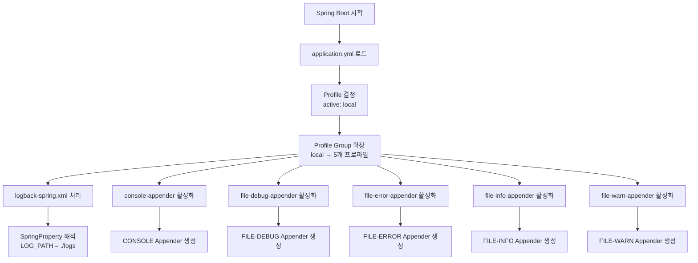

# Chapter 05: MyBatis와 로깅

### 개요
MyBatis를 활용한 데이터 액세스 계층 구현과 Spring Transaction 관리, Logback을 통한 로깅 설정을 다루는 모듈입니다. 트랜잭션 전파(Propagation)와 격리 수준(Isolation Level)의 실제 구현 사례를 포함합니다.

### 주요 기능
- MyBatis 기반 데이터 액세스 계층 구현
- Spring Transaction 전파 및 격리 수준 테스트
- Logback을 통한 로깅 설정 및 파일 출력
- Dynamic SQL을 활용한 동적 쿼리 생성
- TypeHandler를 통한 Enum 타입 매핑
- 리팩토링 예제 (God Class → SRP 적용)

### 🔄 최신 업데이트 - 로깅 시스템 개선

**System.out.println을 SLF4J 로깅으로 전환:**

#### 변경된 파일:
- `AccountAnalyzer`: 계정 분석 결과 출력을 구조화된 로깅으로 개선
  - 총액, 월별, 카테고리별 집계 결과를 파라미터화된 로깅으로 변경
  - 비즈니스 로직 처리 결과를 적절한 INFO 레벨로 기록

#### 개선 효과:
- **성능 최적화**: 파라미터화된 메시지로 문자열 연산 최적화
- **구조화된 데이터**: 로그 분석 도구에서 쉽게 파싱 가능한 형태
- **비즈니스 모니터링**: 계정 분석 결과를 체계적으로 추적 가능

### 기술 스택
- Spring Boot 3.x
- MyBatis + MyBatis Dynamic SQL
- MariaDB 11.4.7
- Logback
- TestContainers
- Lombok

### Logback 설정 상세 가이드

#### 1. Logback-Spring.xml 구조
```xml
<?xml version="1.0" encoding="UTF-8"?>
<configuration scan="true">
    <!-- Spring 프로퍼티를 Logback 변수로 변환 -->
    <springProperty scope="context" name="LOG_PATH" source="primavera.logs.path"/>
    <timestamp key="BY_DATE" datePattern="yyyy-MM-dd"/>
    
    <!-- Profile별 Appender 포함 -->
    <include resource="logging/logback/console-appender.xml"/>
    <include resource="logging/logback/file-debug-appender.xml"/>
    <include resource="logging/logback/file-error-appender.xml"/>
    <include resource="logging/logback/file-info-appender.xml"/>
    <include resource="logging/logback/file-warn-appender.xml"/>
    
    <logger name="com.genius.primavera" level="DEBUG"/>
    
    <root level="DEBUG">
        <appender-ref ref="CONSOLE"/>
    </root>
</configuration>
```

#### 2. SpringProperty 태그 활용
- **목적**: Spring Boot의 application.yml 설정값을 Logback에서 사용
- **동작 원리**:
  ```yaml
  # application.yml
  primavera:
    logs:
      path: ./logs
  ```
  ↓
  ```xml
  <!-- logback-spring.xml에서 ${LOG_PATH}로 참조 -->
  <springProperty scope="context" name="LOG_PATH" source="primavera.logs.path"/>
  <file>${LOG_PATH}/info/info-${BY_DATE}.log</file>
  ```

#### 3. Spring Profile Group 메커니즘
```yaml
spring:
  profiles:
    active: local
    group:
      local:  # local 프로파일 활성화 시 아래 5개 프로파일 모두 활성화
        - console-appender
        - file-debug-appender
        - file-error-appender
        - file-info-appender
        - file-warn-appender
      test:   # test 프로파일 활성화 시 console만 활성화
        - console-appender
      production:  # production 프로파일 활성화 시 선택적 활성화
        - console-appender
        - file-error-appender
        - file-warn-appender
```

#### 4. Profile별 Appender 구현 예시
```xml
<!-- file-info-appender.xml -->
<included>
    <springProfile name="file-info-appender">
        <appender name="FILE-INFO" class="ch.qos.logback.core.rolling.RollingFileAppender">
            <file>${LOG_PATH}/info/info-${BY_DATE}.log</file>
            <filter class="ch.qos.logback.classic.filter.LevelFilter">
                <level>INFO</level>
                <onMatch>ACCEPT</onMatch>
                <onMismatch>DENY</onMismatch>
            </filter>
            <rollingPolicy class="ch.qos.logback.core.rolling.SizeAndTimeBasedRollingPolicy">
                <fileNamePattern>${LOG_PATH}/backup/info/info-%d{yyyy-MM-dd}.%i.gz</fileNamePattern>
                <maxFileSize>${LOG_FILE_MAX_SIZE:-100MB}</maxFileSize>
                <maxHistory>${LOG_FILE_MAX_HISTORY:-7}</maxHistory>
                <totalSizeCap>${LOG_FILE_TOTAL_SIZE_CAP:-3GB}</totalSizeCap>
            </rollingPolicy>
            <encoder>
                <pattern>%d{yyyy-MM-dd HH:mm:ss.SSS} [%thread] %-5level %logger{36} - %msg%n</pattern>
            </encoder>
        </appender>
        <root level="INFO">
            <appender-ref ref="FILE-INFO"/>
        </root>
    </springProfile>
</included>
```

#### 5. 로깅 설정 통합 플로우


#### 6. 환경별 로깅 전략

| 환경 | 활성 프로파일 | 로깅 전략 | 사용 목적 |
|---|---|---|---|
| 개발(local) | local | 모든 레벨 파일 + 콘솔 | 상세한 디버그 정보 수집 |
| 테스트(test) | test | 콘솔만 | 빠른 피드백, 파일 I/O 최소화 |
| 운영(production) | production | ERROR/WARN 파일 + 콘솔 | 중요 이슈만 기록, 성능 최적화 |

#### 7. 로깅 데모 API
```bash
# 로깅 데모 실행
curl http://localhost:8080/api/logging/demo

# 프로파일 정보 확인
curl http://localhost:8080/api/logging/profile-info
```

### Mybatis Auto Configuration
```
mybatis:
  configuration:
    map-underscore-to-camel-case: true
    default-fetch-size: 1000
    default-statement-timeout: 30
  type-aliases-package: com.genius.primavera.domain
  type-handlers-package: com.genius.primavera.domain
```

### WINNER TABLE
```
CREATE TABLE IF NOT EXISTS WINNER (
    ID int(11) NOT NULL AUTO_INCREMENT,
    USER_ID int(45) NOT NULL,
    WINNER enum('WINNER','LOSER') NOT NULL,
    REG_DT datetime NOT NULL,
    PRIMARY KEY (ID)
) ENGINE=InnoDB DEFAULT CHARSET=utf8mb4;
```

### Spring Boot Test
* WinnerServiceIsolationTest
* WinnerServicePropagationTest
* RoleMapperTest
* UserMapperTest (Dynamic Sql)
* WinnerMapperTest

### ACID (원자성, 일관성, 격리성, 지속성)
* 원자성(Atomicity) : 트랜잭션은 연속적인 액션들로 이루어진 원자성 작업, 트랜잭션의 액션은 전부다 수행되거나 아무것도 수행되지 안도록 보장 
* 일관성(Consistency) : 트랜잭션의 액션이 모두 완료되면 커밋되고 데이터 및 리소스는 비즈니스 규칙에 맞게 일관된 상태를 유지
* 격리성(Isolation) : 동일한 데이터 여러 트랜잭션이 동시에 처리할 경우 데이터가 변질되지 않게 하려면 각각의 트랜잭션을 격리
* 지속성(Durability) : 트랜잭션 완료 후 그 결과는 설령 시스템이 실패 하더라도 살마남아야 함 (보통 트랜잭션 결과물은 퍼시스턴스 저장소에 씌어짐)

## 🎯 WinnerServiceImpl - 트랜잭션 전파 및 격리수준 실습

### 📋 서비스 설계 의도

`WinnerServiceImpl`은 Spring의 트랜잭션 전파(Propagation)와 격리 수준(Isolation Level)을 체계적으로 학습하기 위한 교육용 서비스입니다. 다양한 트랜잭션 시나리오를 시뮬레이션하여 실무에서 마주할 수 있는 트랜잭션 처리 상황을 경험할 수 있도록 설계되었습니다.

### 🔄 트랜잭션 전파 패턴 분석

#### 1. **기본 저장 메서드**
```java
@Transactional(propagation = Propagation.REQUIRED, rollbackFor = RollbackForClass.class, noRollbackFor = NoRollbackForClass.class)
public int save(Winner winner) {
    return winnerMapper.save(winner);
}
```
- **목적**: 기본적인 트랜잭션 동작 학습
- **특징**: 커스텀 롤백/논롤백 예외 처리 시연
- **학습 포인트**: 예외별 롤백 정책 제어

#### 2. **복합 트랜잭션 패턴**

**`saveAndNew` - 독립 트랜잭션 조합**
```java
@Transactional(propagation = Propagation.REQUIRED, noRollbackFor = DataIntegrityViolationException.class)
public int saveAndNew(Winner winner1, Winner winner2, Winner winner3, WinnerService winnerService) {
    winnerMapper.save(winner1);    // 부모 트랜잭션
    winnerService.saveRequiresNew(winner2);  // 독립 트랜잭션
    winnerMapper.save(winner3);    // 부모 트랜잭션
    return 0;
}
```

**`saveAndNested` - 중첩 트랜잭션 패턴 (현재 REQUIRES_NEW로 수정됨)**
```java
@Transactional(propagation = Propagation.REQUIRED, noRollbackFor = DataIntegrityViolationException.class)
public int saveAndNested(Winner winner1, Winner winner2, Winner winner3, WinnerService winnerService) {
    winnerMapper.save(winner1);     // 부모 트랜잭션
    winnerService.saveNested(winner2);     // 새 트랜잭션 (원래는 NESTED 의도)
    winnerMapper.save(winner3);     // 부모 트랜잭션
    return 0;
}
```

**`saveAndNotSupported` - 트랜잭션 일시정지**
```java
@Transactional(propagation = Propagation.REQUIRED)
public int saveAndNotSupported(Winner winner1, Winner winner2, Winner winner3, WinnerService winnerService) {
    winnerMapper.save(winner1);          // 트랜잭션 내
    winnerService.saveNotSupported(winner2);    // 트랜잭션 일시정지
    winnerMapper.save(winner3);          // 트랜잭션 재개
    return 0;
}
```

#### 3. **전파 유형별 개별 메서드**

| 메서드 | 전파 타입 | 동작 특성 | 사용 목적 |
|--------|-----------|-----------|-----------|
| `saveNotSupported` | NOT_SUPPORTED | 트랜잭션 없이 실행 | 트랜잭션 일시정지 학습 |
| `saveNested` | REQUIRES_NEW | 새 독립 트랜잭션 | 격리된 처리 학습 |
| `saveRequiresNew` | REQUIRES_NEW | 새 독립 트랜잭션 | 독립 트랜잭션 학습 |

#### 4. **배치 처리 패턴**

**`saveAll` - 단일 트랜잭션 배치**
```java
@Transactional(propagation = Propagation.REQUIRES_NEW)
public int saveAll(List<Winner> winners) {
    for (int i = 0; i < winners.size(); i++) {
        winnerMapper.save(winners.get(i));
    }
    return winners.size();
}
```

**`innerSave` - 내부 호출 패턴**
```java
@Transactional(propagation = Propagation.REQUIRED)
public int innerSave(List<Winner> winners) {
    for (Winner winner : winners) this.save(winner);  // 같은 객체 내 메서드 호출
    return winners.size();
}
```
- **학습 포인트**: 같은 객체 내 메서드 호출 시 AOP 프록시가 적용되지 않는 문제

**`innerSaveNew` - 내부 호출 + 새 트랜잭션**
```java
@Transactional(propagation = Propagation.REQUIRED)
public int innerSaveNew(List<Winner> winners) {
    for (Winner winner : winners) this.saveRequiresNew(winner);  // REQUIRES_NEW 호출 시도
    return winners.size();
}
```
- **주의사항**: 셀프 인보케이션으로 인해 REQUIRES_NEW가 동작하지 않음

### 🔒 격리 수준(Isolation Level) 학습

#### 1. **READ_UNCOMMITTED**
```java
@Transactional(isolation = Isolation.READ_UNCOMMITTED)
public List<Winner> findAllUncommitted() {
    return winnerMapper.findAll();
}
```
- **특징**: 가장 낮은 격리 수준, 더티 리드 허용
- **용도**: 속도 우선, 정확성 차순위인 경우

#### 2. **READ_COMMITTED**
```java
@Transactional(isolation = Isolation.READ_COMMITTED)
public List<Winner> findAllCommitted() {
    return winnerMapper.findAll();
}

@Transactional(isolation = Isolation.READ_COMMITTED)
public Winner findAllByIdReadCommitted(Long id) {
    return winnerMapper.findById(id);
}
```
- **특징**: 커밋된 데이터만 읽기, 더티 리드 방지
- **용도**: 일반적인 조회 작업

#### 3. **REPEATABLE_READ**
```java
@Transactional(propagation = Propagation.REQUIRES_NEW, isolation = Isolation.REPEATABLE_READ)
public Winner findAllByIdRepeatableRead(Long id) {
    return winnerMapper.findById(id);
}
```
- **특징**: 같은 트랜잭션 내에서 동일한 데이터 보장
- **용도**: 일관된 읽기가 필요한 비즈니스 로직

### 🧪 테스트 시나리오별 학습 목표

#### 1. **기본 CRUD 테스트**
```java
@Test
@Order(1)
@DisplayName("save 메소드 테스트")
public void save() {
    // 기본 트랜잭션 동작 확인
}
```

#### 2. **복합 트랜잭션 테스트**
- `saveAndNew`: 독립 트랜잭션과 부모 트랜잭션의 상호작용
- `saveAndNested`: 중첩 트랜잭션(현재 REQUIRES_NEW) 동작
- `saveAndNotSupported`: 트랜잭션 일시정지/재개

#### 3. **격리수준 테스트**
- `findAllUncommitted`: 더티 리드 가능성 테스트
- `findAllCommitted`: 커밋된 데이터만 읽기
- `findAllByIdRepeatableRead`: 반복 읽기 일관성 테스트

### 💡 실무 적용 시나리오

#### 1. **은행 송금 시스템**
```java
// 송금 처리 - 출금과 입금이 별도 트랜잭션
@Transactional(propagation = Propagation.REQUIRED)
public void transfer(Account from, Account to, BigDecimal amount) {
    withdraw(from, amount);        // 출금 (부모 트랜잭션)
    depositInNewTransaction(to, amount);  // 입금 (새 트랜잭션)
}
```

#### 2. **배치 처리 시스템**
```java
// 대용량 데이터 처리 - 부분 실패 허용
@Transactional(propagation = Propagation.REQUIRED, noRollbackFor = BusinessException.class)
public void processBatch(List<Data> dataList) {
    for (Data data : dataList) {
        processInNewTransaction(data);  // 개별 트랜잭션으로 처리
    }
}
```

#### 3. **로깅 시스템**
```java
// 감사 로그 - 비즈니스 트랜잭션 실패와 무관
@Transactional(propagation = Propagation.NOT_SUPPORTED)
public void auditLog(String operation, Object data) {
    // 트랜잭션 없이 감사 로그 기록
}
```

### ⚠️ 주의사항과 함정

#### 1. **셀프 인보케이션 문제**
```java
// ❌ 동작하지 않음
@Transactional(propagation = Propagation.REQUIRED)
public void methodA() {
    this.methodB();  // AOP 프록시 우회
}

@Transactional(propagation = Propagation.REQUIRES_NEW)
public void methodB() {
    // REQUIRES_NEW가 적용되지 않음
}

// ✅ 해결책: 별도 서비스 주입
@Transactional(propagation = Propagation.REQUIRED)  
public void methodA() {
    otherService.methodB();  // 프록시를 통한 호출
}
```

#### 2. **예외 처리 전략**
```java
// DataIntegrityViolationException은 롤백하지 않음
@Transactional(noRollbackFor = DataIntegrityViolationException.class)
public void saveWithConstraintHandling() {
    // 제약조건 위반 시에도 부분 커밋 허용
}
```

#### 3. **격리수준 선택 가이드**
- **READ_UNCOMMITTED**: 성능 최우선, 대용량 집계
- **READ_COMMITTED**: 일반적인 업무 처리 (기본값)
- **REPEATABLE_READ**: 정합성 중요한 금융 업무
- **SERIALIZABLE**: 매우 높은 정합성 요구 시

### 🎓 학습 체크리스트

- [ ] 각 전파 타입의 동작 차이를 이해했는가?
- [ ] 셀프 인보케이션 문제를 인지하고 있는가?
- [ ] 예외별 롤백 정책을 설정할 수 있는가?
- [ ] 격리수준별 데이터 가시성 차이를 아는가?
- [ ] 실무에서 어떤 패턴을 사용해야 할지 판단할 수 있는가?

### Spring Propagation
| 전달 속성 | 설명 |
|---|---|
| REQUIRED | 진행 중인 트랜잭션이 있으면 현재 메서드를 그 트랜잭션에서 실행하되, 그렇지 않을 경우 새 트랜잭션을 시작해서 실행 |
| REQUIRES_NEW | 항상 새 트랜잭션을 시작해 현재 메서드를 실행하고 진행 중인 트랜잭션이 있으면 잠시 중단 |
| SUPPORTS | 진행 중인 트랜잭션이 있으면 현재 메서드를 그 트랜잭션 내에서 실행하되, 그렇지 않을 경우 트랜잭션 없이 실행 |
| NOT_SUPPORTED | 트랜잭션 없이 현재 메서드를 실행하고 진행 중인 트랜잭션이 있으면 잠시 중단 시킴 |
| MANDATORY | 반드시 트랜잭션을 걸고 현재 메서드를 실행하되 진행 중인 트랜잭션이 없으면 예외를 던짐 |
| NEVER | 반드시 트랜잭션 없이 현재 메서드를 실행하되 진행 중인 트랜잭션이 있으면 예외를 던짐 |
| NESTED | 진행 중인 트랜잭션이 있으면 현재 메서드를 이 트랜잭션의 중첩 트랜잭션 내에서 실행함. 진행 중인 트랜잭션에 영향을 받음. 진행 중인 트랜잭션이 없으면 새 트랜잭션을 시작해서 실행함 이 기능은 스프링에서만 사용됨 |

### Read phenomena
* Dirty read : T2가 수정 후 커밋하지 않은 필드을 T1이 읽는 상황에서 나중에 T2가 롤백하면 T1이 읽은 필드는 일시적인 값으로 더 이상 유효하지 않음
* Nonrepeatable read : 어떤 필드를 T1이 읽은 후 T2가 수정할 경우, T1이 같은 필드를 다시 읽으면 다른 값을 얻음 
* Phantom read : T1이 테이블의 로우 몇 개를 읽은 후 T2가 같은 테이블에 새 로우를 삽입할 경우, 나중에 T1이 같은 테이블을 다시 읽으면 T2가 삽입한 로우가 보임
* Lost updates : T1, T2 모두 어떤 로우를 수정하려고 읽고 그 로우의 상태에 따라 수정하려는 경우. T1이 먼저 로우를 수정 후 커밋하기 전 T2가 T1이 수정한 로우를 똑같이 수정했다면 T1이 커밋한 후에 T2 역시 커밋을 하게 되면 T1이 수정한 로우를 T2가 덮어쓰게 되어 T1이 수정 한 내용이 소실

### Spring Isolation

| 격리 수준 | 설명 |
|---|---|
| DEFAULT | 데이터베이스 기본 격리 수준을 사용. 대다수 데이터베이스는 READ_COMMITTED 기본 격리 수준 |
| READ_UNCOMMITTED | 다른 트랜잭션이 아직 커밋하지 않은 값을 트랜잭션이 읽을 수 있음. 오염된 값 읽기, 재현 불가한 읽기, 허상 읽기 문제가 발생 |
| READ_COMMITTED | 한 트랜잭션이 다른 트랜잭션이 커밋한 값만 읽을 수 있음. 오염된 값 읽기 문제는 해결. 재현 불가한 일기, 허상 읽기 문제는 남음 |
| REPEATABLE_READ | 트랜잭션이 어떤 필드를 여러 번 읽어도 동일한 값을 읽도록 보장. 트랜잭션이 지속되는 동안에는 다른 트랜잭션이 해당 필드를 변경 할 수 없음. 오염된 값 읽기, 재현 불가한 읽기 문제는 해결되지만 허상 읽기는 여젼히 숙제 |
| SERIALIZABLE | 트랜잭션이 테이블을 여러 번 읽어도 정확히 동일한 로우를 읽도록 보장. 트랜잭션이 지속되는 동안에는 다른 트랜잭션이 해당 테이블에 삽입 수정, 삭제를 할 수 없음. 동시성 문제는 모두 해소되지만 성능은 현저히 떨어짐 |

## 핵심 구현 요소

### 1. 트랜잭션 관리 (WinnerService)
- **@Transactional 어노테이션 기반 선언적 트랜잭션 관리**
- **Propagation 속성별 구현**:
  - REQUIRED: 기본 트랜잭션 전파
  - REQUIRES_NEW: 새로운 트랜잭션 생성
  - NESTED: 중첩 트랜잭션 처리
  - NOT_SUPPORTED: 트랜잭션 없이 실행
- **Isolation Level 구현**:
  - READ_UNCOMMITTED: Dirty Read 허용
  - READ_COMMITTED: Committed 데이터만 읽기
  - REPEATABLE_READ: 반복 읽기 보장
- **롤백 제어**: rollbackFor, noRollbackFor 속성 활용

### 2. MyBatis 매퍼 구현
- **UserMapper**: Dynamic SQL을 활용한 동적 쿼리
- **RoleMapper**: 기본 CRUD 작업
- **WinnerMapper**: 트랜잭션 테스트용 매퍼
- **UserTableSupport**: MyBatis Dynamic SQL 지원

### 3. TypeHandler 구현
- **RoleTypeHandler**: RoleType Enum ↔ String 변환
- **UserStatusTypeHandler**: UserStatus Enum ↔ String 변환

### 4. 리팩토링 예제 (Account 패키지)
- **AccountGodClass**: 모든 책임을 가진 God Class (안티패턴)
- **리팩토링된 구조**:
  - AccountParser: CSV 파싱 책임
  - AccountProcessor: 계산 로직 책임
  - AccountAnalyzer: 분석 및 출력 책임
  - AccountInfo: 도메인 모델
- **단일 책임 원칙(SRP) 적용**

### 5. Logging 설정
- **레벨별 파일 분리**: DEBUG, INFO, WARN, ERROR
- **콘솔 및 파일 동시 출력**
- **일별 로그 파일 롤링**
- **MyBatis SQL 로깅 설정**
- **SpringProperty를 통한 동적 경로 설정**
- **Profile Group을 통한 환경별 Appender 관리**

#### Logback 고급 기능
1. **동적 설정 리로딩**: `scan="true"` 속성으로 runtime 설정 변경
2. **조건부 Appender 활성화**: `<springProfile>` 태그로 프로파일별 제어
3. **로그 파일 관리**:
   - 크기 기반 롤링: maxFileSize
   - 날짜 기반 롤링: fileNamePattern
   - 압축 보관: .gz 확장자
   - 보관 기간 제한: maxHistory
   - 전체 용량 제한: totalSizeCap

## 테스트 클래스

### 트랜잭션 테스트
- **WinnerServiceIsolationTest**: 격리 수준별 동작 검증
- **WinnerServicePropagationTest**: 전파 속성별 동작 검증

### 매퍼 테스트
- **UserMapperTest**: Dynamic SQL 테스트
- **RoleMapperTest**: 기본 CRUD 테스트
- **WinnerMapperTest**: Insert 및 조회 테스트

### 리팩토링 테스트
- **AccountGodClassTest**: God Class 테스트
- **AccountAnalyzerTest**: 리팩토링된 클래스 테스트
- **AccountCSVParserTest**: CSV 파서 단위 테스트

## 실행 방법

### 1. 데이터베이스 설정
```bash
# MariaDB 11.4.7 실행
docker run -d --name mariadb-primavera \
  -e MARIADB_ROOT_PASSWORD=root \
  -e MARIADB_DATABASE=primavera \
  -e MARIADB_USER=primavera \
  -e MARIADB_PASSWORD=primavera \
  -p 3306:3306 mariadb:11.4.7
```

### 2. 애플리케이션 실행
```bash
./gradlew :chap05:bootRun
```

### 3. 테스트 실행
```bash
# 전체 테스트
./gradlew :chap05:test

# 특정 테스트
./gradlew :chap05:test --tests WinnerServicePropagationTest
```

## ✅ 최근 테스트 개선사항

### TestContainers 현대화 마이그레이션 완료

**Spring Boot 3.x 호환성을 위한 TestContainers 접근 방식 개선:**

#### 마이그레이션된 테스트 파일들:
- `UserMapperTest`: MyBatis 동적 SQL 매퍼 테스트
- `RoleMapperTest`: 역할 관리 매퍼 테스트  
- `WinnerMapperTest`: 승부 결과 매퍼 테스트
- `HikariBalancedPoolTest`: 균형 잡힌 커넥션 풀 테스트
- `HikariMinimalPoolTest`: 최소 커넥션 풀 테스트
- `HikariPerformancePoolTest`: 성능 최적화 커넥션 풀 테스트
- `HikariResourceConstrainedPoolTest`: 리소스 제한 커넥션 풀 테스트
- `ACIDPropertiesTest`: ACID 속성 검증 테스트
- `IsolationLevelTest`: 트랜잭션 격리 수준 테스트
- `SpringPropagationTest`: 트랜잭션 전파 테스트
- `ReadPhenomenaTest`: 읽기 현상 테스트

#### 새로운 TestContainers 패턴 (현재 방식)
```java
@SpringBootTest
@Testcontainers
@ActiveProfiles("test")
@DisplayName("사용자 매퍼 통합 테스트")
class UserMapperTest {

    @Container
    static MariaDBContainer<?> mariadb = new MariaDBContainer<>("mariadb:11.4")
            .withDatabaseName("primavera")
            .withUsername("primavera")
            .withPassword("primavera")
            .withInitScript("sql/init.sql");

    @DynamicPropertySource
    static void configureProperties(DynamicPropertyRegistry registry) {
        registry.add("spring.datasource.url", mariadb::getJdbcUrl);
        registry.add("spring.datasource.username", mariadb::getUsername);
        registry.add("spring.datasource.password", mariadb::getPassword);
        registry.add("spring.datasource.driver-class-name", mariadb::getDriverClassName);
    }

    @Autowired
    private UserMapper userMapper;

    @Test
    void testUserCreation() {
        User user = User.builder()
            .email("test@example.com")
            .nickname("testuser")
            .build();
        userMapper.save(user);
        
        assertThat(user.getId()).isNotNull();
    }
}
```

#### 이전 방식 (@EnablePrimaveraTestcontainers)
```java
@SpringBootTest
@EnablePrimaveraTestcontainers  // 더 이상 사용하지 않음
@ActiveProfiles("test")
class MyIntegrationTest {
    // 커스텀 어노테이션에 의존
}
```

#### 마이그레이션의 주요 개선 효과:
- **Spring Boot 3.x 완전 호환**: 표준 TestContainers 어노테이션 사용
- **투명성 향상**: 테스트 설정이 명시적으로 보여 디버깅 용이
- **종속성 독립**: 커스텀 스타터에 의존하지 않는 표준 접근법  
- **유연성 증대**: 각 테스트별로 컨테이너 설정 개별 커스터마이징 가능
- **표준 준수**: Spring 공식 TestContainers 가이드라인 준수

### 실무 활용 팁

#### 1. Profile Group 활용 가이드
- **개발 환경**: 모든 로그 레벨을 파일로 저장하여 문제 추적 용이
- **테스트 환경**: 콘솔만 사용하여 CI/CD 파이프라인 성능 향상
- **운영 환경**: ERROR/WARN만 파일 저장하여 디스크 사용량 최적화

#### 2. 로그 레벨 가이드라인
```java
log.trace("매우 상세한 추적 정보");      // 메서드 진입/종료
log.debug("디버깅 정보");               // 변수값, 상태 정보
log.info("일반 정보");                  // 비즈니스 이벤트
log.warn("경고 메시지");                // 잠재적 문제
log.error("오류 메시지", exception);    // 실제 오류
```

#### 3. 성능 최적화
- **조건부 로깅**: 성능이 중요한 경우 isDebugEnabled() 체크
- **파라미터화된 메시지**: 문자열 연결 대신 {} 플레이스홀더 사용
- **비동기 로깅**: 대용량 처리 시 AsyncAppender 고려

## 🐳 인프라 설정

### Docker Compose 환경 설정

이 챕터는 **기초 학습용 인프라**를 사용합니다:

```bash
# infrastructure 디렉터리로 이동
cd infrastructure

# 기초 학습용 Docker Compose 실행 (MariaDB)
docker-compose -f docker-compose.basic.yml up -d

# 서비스 상태 확인
docker-compose -f docker-compose.basic.yml ps

# 정리 (컨테이너 및 볼륨 삭제)
docker-compose -f docker-compose.basic.yml down -v
```

**포함된 서비스:**
- **MariaDB 11.4.7** (포트: 3308)
- 기본 데이터베이스 스키마 자동 생성

**애플리케이션 실행:**
```bash
# 인프라 시작 후 애플리케이션 실행
./gradlew :chap05:bootRun -Dspring.profiles.active=local
```

### 참고 자료
* Logback 공식 문서: [https://logback.qos.ch/](https://logback.qos.ch/)
* Spring Boot Logging: [https://docs.spring.io/spring-boot/docs/current/reference/html/features.html#features.logging](https://docs.spring.io/spring-boot/docs/current/reference/html/features.html#features.logging)
* MyBatis 공식 문서: [http://www.mybatis.org/mybatis-3/](http://www.mybatis.org/mybatis-3/)
* MyBatis Dynamic SQL: [http://www.mybatis.org/mybatis-dynamic-sql/docs/introduction.html](http://www.mybatis.org/mybatis-dynamic-sql/docs/introduction.html)
* Spring Boot AutoConfigure: [http://www.mybatis.org/spring-boot-starter/mybatis-spring-boot-autoconfigure/](http://www.mybatis.org/spring-boot-starter/mybatis-spring-boot-autoconfigure/)
