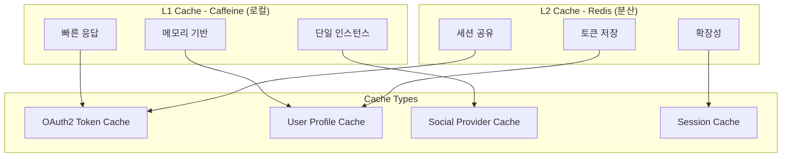

## chap10 - OAuth2 Social Login Application

### 개요
Spring Boot 3.x와 Spring Security 6.x를 활용한 소셜 로그인(OAuth2) 통합 애플리케이션입니다. Google, Facebook, GitHub, Kakao 4개 소셜 로그인 프로바이더를 지원하며, HTTPS(SSL/TLS) 보안 연결과 XSS 방어를 위한 Lucy Filter가 적용되어 있습니다.

### 주요 기능
- **OAuth2 소셜 로그인**: Google, Facebook, GitHub, Kakao 계정으로 로그인
- **통합 사용자 관리**: 소셜 계정을 내부 사용자 시스템과 연동
- **보안 강화**: HTTPS 필수 적용, Lucy XSS Filter 통합
- **세션 관리**: 소셜 로그인 토큰 관리 및 자동 갱신
- **사용자 프로필 동기화**: 소셜 프로필 정보 자동 업데이트

### 아키텍처 특징

#### 1. OAuth2 통합 구조
- **Spring Security OAuth2 Client**: 표준 OAuth2 클라이언트 구현
- **커스텀 OAuth2UserService**: 각 프로바이더별 사용자 정보 처리
- **UserConnection 모델**: 소셜 계정과 내부 사용자 연결 관리
- **Provider별 UserDetails**: Google, Facebook, GitHub, Kakao 전용 모델

#### 2. 보안 설정
- **SSL/TLS 필수**: PKCS12 인증서 기반 HTTPS 적용
- **CSRF 보호**: 상태 변경 요청에 대한 CSRF 토큰 검증
- **XSS 방어**: Lucy Filter를 통한 악성 스크립트 차단
- **접근 제어**: URL 패턴 기반 권한 관리

#### 3. 캐싱 전략 아키텍처 🚀 **NEW**
- **다중 캐시 백엔드**: Redis(분산) + Caffeine(로컬) 하이브리드 구조
- **OAuth2 토큰 캐싱**: 액세스 토큰 및 리프레시 토큰 관리
- **사용자 프로필 캐싱**: 소셜 프로필 정보 고속 조회
- **스마트 무효화**: 토큰 만료 기반 자동 정리
- **실시간 모니터링**: 캐시 상태 및 성능 대시보드

#### 4. 모듈 구조
```
chap10/
├── infrastructure/
│   ├── cache/                                     # 🆕 캐싱 전략
│   │   ├── CacheConfiguration.java                # Redis + Caffeine 설정
│   │   ├── OAuth2TokenCacheService.java           # 토큰 캐싱 서비스
│   │   ├── UserProfileCacheService.java           # 프로필 캐싱 서비스
│   │   └── CacheEvictionStrategy.java             # 캐시 무효화 전략
│   ├── security/
│   │   ├── PrimaveraSecurityConfiguration.java    # Spring Security 설정
│   │   ├── PrimaveraUserDetailsService.java       # 일반 로그인 처리
│   │   └── social/
│   │       ├── PrimaveraSocialConfiguration.java  # OAuth2 설정
│   │       └── provider별 UserDetails 클래스
│   └── filter/
│       └── PrimaveraFilter.java                   # 커스텀 필터
├── domain/
│   └── model/
│       └── UserConnection.java                    # 소셜 연동 정보
└── interfaces/
    ├── LoginController.java                       # 로그인 화면 제어
    └── CacheManagementController.java             # 🆕 캐시 관리 API
```

### build.gradle 의존성 추가

```gradle
dependencies {
    // Spring Security OAuth2 Client
    implementation "org.springframework.boot:spring-boot-starter-oauth2-client"
    implementation "org.springframework.security:spring-security-oauth2-client"
    implementation "org.springframework.security:spring-security-oauth2-jose"
    
    // 🆕 캐싱 전략 의존성
    implementation "org.springframework.boot:spring-boot-starter-cache"
    implementation "org.springframework.boot:spring-boot-starter-data-redis"
    implementation "org.redisson:redisson-spring-boot-starter:${redissonVersion}"
    implementation "com.github.ben-manes.caffeine:caffeine:${caffeineVersion}"
    
    // Thymeleaf Security 통합
    implementation "org.thymeleaf.extras:thymeleaf-extras-springsecurity6"
    
    // XSS 방어
    implementation project(":appendix:spring-boot-starter-lucy-filter")
}
```

### application.yml 설정
```yaml
# SSL/TLS 설정
server:
  ssl:
    key-alias: primavera
    key-store: infrastructure/certs/primavera.p12
    key-store-type: PKCS12
    key-store-password: primavera
    enabled: true
  port: 8443

# Spring Security OAuth2 Client 설정 (Spring Boot 3.x 방식)
spring:
  security:
    oauth2:
      client:
        registration:
          google:
            client-id: ${OAUTH2_GOOGLE_CLIENTID}
            client-secret: ${OAUTH2_GOOGLE_CLIENTSECRET}
            scope:
              - email
              - profile
            redirect-uri: "{baseUrl}/login/oauth2/code/{registrationId}"
          facebook:
            client-id: ${OAUTH2_FACEBOOK_CLIENTID}
            client-secret: ${OAUTH2_FACEBOOK_CLIENTSECRET}
            scope:
              - email
              - public_profile
            redirect-uri: "{baseUrl}/login/oauth2/code/{registrationId}"
          github:
            client-id: ${OAUTH2_GITHUB_CLIENTID}
            client-secret: ${OAUTH2_GITHUB_CLIENTSECRET}
            scope:
              - user:email
              - read:user
            redirect-uri: "{baseUrl}/login/oauth2/code/{registrationId}"
          kakao:
            client-id: ${OAUTH2_KAKAO_CLIENTID}
            client-secret: ${OAUTH2_KAKAO_CLIENTSECRET:}
            authorization-grant-type: authorization_code
            redirect-uri: "{baseUrl}/login/oauth2/code/{registrationId}"
            scope:
              - profile_nickname
              - account_email
        provider:
          kakao:
            authorization-uri: https://kauth.kakao.com/oauth/authorize
            token-uri: https://kauth.kakao.com/oauth/token
            user-info-uri: https://kapi.kakao.com/v2/user/me
            user-name-attribute: id
```

### OAuth2 인증 흐름

#### 1. 로그인 프로세스
1. 사용자가 소셜 로그인 버튼 클릭
2. OAuth2 프로바이더 인증 페이지로 리다이렉트
3. 사용자 인증 및 권한 동의
4. Authorization Code와 함께 콜백 URL로 리다이렉트
5. Authorization Code를 Access Token으로 교환
6. Access Token으로 사용자 정보 조회
7. 내부 사용자 시스템과 연동 및 세션 생성

#### 2. 핵심 컴포넌트
- **PrimaveraSocialConfiguration**: OAuth2UserService 빈 정의
- **OAuth2UserService**: 프로바이더별 사용자 정보 처리
- **UserConnection**: 소셜 계정 연동 정보 저장
- **PrimaveraSocialUserDetailsService**: 소셜 사용자 인증 처리

#### 3. 프로바이더별 처리
- **Google**: email, name, picture 정보 수집
- **Facebook**: id, email, name 정보 수집  
- **GitHub**: login, email, name, avatar_url 정보 수집
- **Kakao**: id, kakao_account(email, profile) 정보 수집

### SSL/TLS 설정

#### 인증서 생성
```bash
# infrastructure/certs 디렉토리에서 실행
keytool -genkeypair -alias primavera -storetype PKCS12 -keyalg RSA -keysize 2048 -keystore primavera.p12 -validity 3650
```

#### 로컬 개발 환경 설정
hosts 파일 수정 (선택사항):
```
127.0.0.1       local.primavera.com
```

#### 소셜 프로바이더 콜백 URL 설정
각 프로바이더의 개발자 콘솔에서 다음 콜백 URL을 등록해야 합니다:
- **Google**: `https://localhost:8443/login/oauth2/code/google`
- **Facebook**: `https://localhost:8443/login/oauth2/code/facebook`
- **GitHub**: `https://localhost:8443/login/oauth2/code/github`
- **Kakao**: `https://localhost:8443/login/oauth2/code/kakao`

### 환경 변수 설정
OAuth2 클라이언트 정보는 환경 변수로 관리합니다:
```bash
export OAUTH2_GOOGLE_CLIENTID=your-google-client-id
export OAUTH2_GOOGLE_CLIENTSECRET=your-google-client-secret
export OAUTH2_FACEBOOK_CLIENTID=your-facebook-client-id
export OAUTH2_FACEBOOK_CLIENTSECRET=your-facebook-client-secret
export OAUTH2_GITHUB_CLIENTID=your-github-client-id
export OAUTH2_GITHUB_CLIENTSECRET=your-github-client-secret
export OAUTH2_KAKAO_CLIENTID=your-kakao-client-id
```

### 실행 방법
```bash
# MariaDB 컨테이너 실행 (infrastructure 디렉토리)
docker-compose up -d mariadb

# 애플리케이션 실행
./gradlew :chap10:bootRun --args='--spring.profiles.active=local'

# 브라우저에서 접속
https://localhost:8443
```

### 데이터베이스 스키마
소셜 로그인 정보를 저장하는 USER_CONNECTION 테이블:
```sql
CREATE TABLE USER_CONNECTION (
    ID BIGINT AUTO_INCREMENT PRIMARY KEY,
    EMAIL VARCHAR(255) NOT NULL,
    PROVIDER VARCHAR(100) NOT NULL,
    PROVIDER_USER_ID VARCHAR(255) NOT NULL,
    DISPLAY_NAME VARCHAR(255),
    PROFILE_URL VARCHAR(512),
    IMAGE_URL VARCHAR(512),
    ACCESS_TOKEN VARCHAR(512) NOT NULL,
    EXPIRE_TIME BIGINT,
    CREATED_AT TIMESTAMP DEFAULT CURRENT_TIMESTAMP,
    UPDATED_AT TIMESTAMP DEFAULT CURRENT_TIMESTAMP ON UPDATE CURRENT_TIMESTAMP,
    UNIQUE KEY UK_USER_CONNECTION (EMAIL, PROVIDER)
);
```

### 주의사항
- **HTTPS 필수**: OAuth2 프로바이더는 보안상 HTTPS 콜백 URL만 허용
- **환경 변수**: 클라이언트 시크릿은 절대 코드에 하드코딩하지 말 것
- **토큰 관리**: Access Token은 암호화하여 저장 권장
- **세션 보안**: 소셜 로그인 후 새로운 세션 ID 생성 필요

## 🚀 고성능 캐싱 전략 가이드

### 캐싱 아키텍처 개요

Chapter 10에서는 OAuth2 소셜 로그인 환경에 특화된 **다계층 캐싱 전략**을 구현합니다:



### 1. OAuth2 토큰 캐싱 전략

#### 주요 특징
- **토큰 생명주기 관리**: 액세스 토큰 만료 시간 기반 TTL 설정
- **자동 갱신**: 리프레시 토큰을 통한 자동 토큰 갱신
- **프로바이더별 분리**: Google, Facebook, GitHub, Kakao 별도 관리
- **보안 강화**: 토큰 암호화 저장 및 접근 제어

#### 구현 예시
```java
@Service
public class OAuth2TokenCacheService {
    
    @Cacheable(value = "oauth2Tokens", key = "#userId + ':' + #provider")
    public Optional<String> getValidAccessToken(String userId, String provider) {
        // 캐시에서 토큰 조회 + 만료 시간 검증
        return getToken(userId, provider)
                .filter(entry -> !isTokenExpired(entry))
                .map(TokenCacheEntry::getAccessToken);
    }
    
    @CachePut(value = "oauth2Tokens", key = "#userId + ':' + #provider") 
    public TokenCacheEntry refreshToken(String userId, String provider,
                                      OAuth2AccessToken newAccessToken) {
        // 새로운 토큰으로 캐시 갱신
    }
}
```

### 2. 사용자 프로필 캐싱

#### 캐싱 대상
- **소셜 프로필 정보**: 이름, 이메일, 프로필 이미지
- **로그인 통계**: 로그인 횟수, 마지막 접속 시간
- **프로바이더 연동 정보**: 다중 소셜 계정 연결 상태

#### 캐시 무효화 전략
```java
// 사용자 정보 변경 시 자동 갱신
@CachePut(value = "userProfiles", key = "#userId")
public UserProfile updateUserProfile(Long userId, User updatedUser) {
    // 프로필 업데이트 후 캐시 갱신
}

// 로그인 시마다 접속 정보 업데이트
@CachePut(value = "userProfiles", key = "#userId")
public UserProfile updateLastLogin(Long userId, String provider) {
    // 로그인 시간 및 프로바이더 정보 갱신
}
```

### 3. 스마트 캐시 정리 전략

#### 자동 정리 스케줄
```java
@Component
public class CacheEvictionStrategy {
    
    @Scheduled(cron = "0 0 * * * *")  // 매시간
    public void cleanupExpiredTokens() {
        // 만료된 토큰 자동 정리
    }
    
    @Scheduled(cron = "0 0 0 * * *")  // 매일 자정
    public void dailyCacheOptimization() {
        // LRU 기반 오래된 캐시 정리
        // 캐시 압축 및 최적화
        // 자주 사용되는 데이터 워밍업
    }
    
    @Scheduled(fixedRate = 300000)    // 5분마다
    public void monitorMemoryUsage() {
        // 메모리 사용률 80% 이상 시 긴급 정리
    }
}
```

### 4. 캐시 모니터링 대시보드

#### 실시간 모니터링 API
```bash
# 캐시 전체 상태 조회
GET /admin/cache/dashboard

# 특정 캐시 상세 정보
GET /admin/cache/oauth2Tokens/details

# 사용자별 캐시 무효화
DELETE /admin/cache/users/{userId}

# 캐시 통계 CSV 다운로드
GET /admin/cache/statistics/export
```

#### 캐시 통계 예시
```json
{
  "tokenCache": {
    "totalEntries": 1250,
    "validEntries": 1180,
    "expiredEntries": 70,
    "hitRatio": "87.50%"
  },
  "profileCache": {
    "totalProfiles": 850,
    "providerDistribution": {
      "google": 340,
      "kakao": 280,
      "github": 150,
      "facebook": 80
    },
    "averageLoginCount": 8.5
  },
  "memory": {
    "used": "245.8 MB",
    "total": "512.0 MB", 
    "usagePercentage": "48.01%"
  }
}
```

### 5. 환경별 캐시 설정

#### 개발 환경 (Caffeine)
```yaml
spring:
  cache:
    type: caffeine
    caffeine:
      spec: maximumSize=1000,expireAfterWrite=30m,recordStats
```

#### 운영 환경 (Redis)
```yaml
spring:
  cache:
    type: redis
    redis:
      time-to-live: 1800000  # 30분
      cache-null-values: false
  data:
    redis:
      host: redis-cluster.primavera.com
      port: 6380
      lettuce:
        pool:
          max-active: 8
          max-idle: 8
```

### 6. 성능 최적화 팁

#### 캐시 키 설계
```java
// ✅ 효율적인 키 네이밍
"oauth2:token:userId:providerId"     // 계층적 구조
"profile:user:12345"                 // 간결하고 명확

// ❌ 비효율적인 키 네이밍  
"user_oauth_token_google_user123"    // 너무 장황
"cache_key_1234"                     // 의미 불명확
```

#### 캐시 TTL 전략
- **OAuth2 토큰**: 1시간 (토큰 만료 시간과 동기화)
- **사용자 프로필**: 2시간 (자주 변경되지 않음)
- **세션 정보**: 30분 (보안상 짧은 주기)
- **소셜 프로바이더 메타데이터**: 6시간 (거의 변경되지 않음)

### 7. 트러블슈팅

#### 캐시 미스 문제
```bash
# Redis 연결 상태 확인
docker exec redis-primavera redis-cli ping

# 캐시 키 존재 여부 확인
docker exec redis-primavera redis-cli EXISTS "oauth2Tokens::userId:google"

# 캐시 통계 조회
curl -X GET "https://localhost:8443/admin/cache/dashboard"
```

#### 메모리 누수 방지
- 정기적 만료된 캐시 정리
- 메모리 사용률 모니터링
- 캐시 크기 제한 설정

## 실행 방법

### 🚀 Spring Boot 애플리케이션 실행

#### 1. 환경 변수 방식 (권장)
```bash
# 로컬 환경으로 실행  
SPRING_PROFILES_ACTIVE=local ./gradlew :chap10:bootRun
```

#### 2. Program Arguments 방식
```bash
# 기본 실행
./gradlew :chap10:bootRun --args='--spring.profiles.active=local'
```

#### 3. IDE 설정 방식
- IntelliJ IDEA: Run Configuration → VM Options 또는 Program Arguments 설정
- VM Options: `-Dspring.profiles.active=local`
- Program Arguments: `--spring.profiles.active=local`

## 🐳 인프라 설정

### Docker Compose 환경 설정

이 챕터는 **MyBatis + 보안 인프라**를 사용합니다:

```bash
# infrastructure 디렉터리로 이동
cd infrastructure

# MyBatis + 보안 학습용 Docker Compose 실행 (MariaDB)
docker-compose -f docker-compose.mybatis.yml up -d

# 서비스 상태 확인
docker-compose -f docker-compose.mybatis.yml ps

# 정리 (컨테이너 및 볼륨 삭제)
docker-compose -f docker-compose.mybatis.yml down -v
```

**포함된 서비스:**
- **MariaDB 11.4.7** (포트: 3308)
- MyBatis 전용 데이터베이스 스키마 자동 생성

**애플리케이션 실행:**
```bash
# 인프라 시작 후 애플리케이션 실행
./gradlew :chap10:bootRun -Dspring.profiles.active=local
```

### 참고 자료
- [Spring Security OAuth2 공식 문서](https://spring.io/guides/tutorials/spring-boot-oauth2/)
- [Spring Cache 추상화 가이드](https://spring.io/guides/gs/caching/)
- [Redis 캐싱 전략 가이드](https://redis.io/docs/manual/patterns/)
- [Caffeine 캐시 라이브러리](https://github.com/ben-manes/caffeine)
- [Google OAuth2 개발자 가이드](https://developers.google.com/identity/protocols/oauth2)
- [Facebook 로그인 구현 가이드](https://developers.facebook.com/docs/facebook-login/manually-build-a-login-flow/)
- [GitHub OAuth Apps 가이드](https://docs.github.com/en/developers/apps/building-oauth-apps/authorizing-oauth-apps)
- [Kakao 로그인 API 문서](https://developers.kakao.com/docs/latest/ko/kakaologin/common)
- [Spring Security 6.x 마이그레이션 가이드](https://github.com/spring-projects/spring-security/wiki/OAuth-2.0-Migration-Guide)